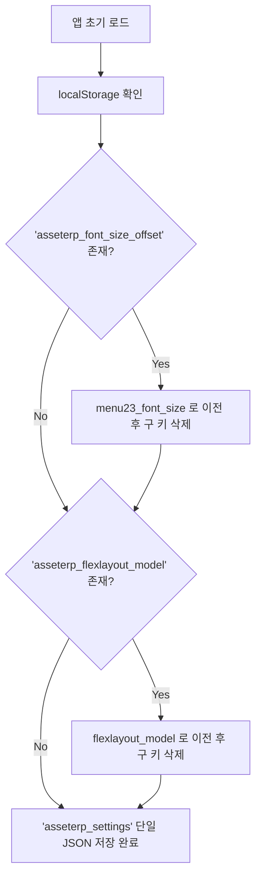

# LocalStorage 설계

## 1. 개요 및 설계 원칙

사용자의 UI 환경설정, 화면 배치 및 레이아웃 상태를 브라우저의 `localStorage`에 안전하게 영속화한다.

### 1.1 원칙
1. **단일 키(Single Key) 원칙**: 여러 설정 변수로 인해 `localStorage` 네임스페이스가 파편화되는 것을 방지하기 위해, 오직 **`asseterp_settings` 단 1개의 Key**에 **1개의 JSON 객체**로 모아서 관리한다.
2. **속성 명명 규칙 (Clean Property Names)**:
   - 개별 설정 항목에는 불필요한 `asseterp_` 접두어를 붙이지 않고, 도메인/컴포넌트 중심의 명확한 스네이크케이스(Snake Case)를 사용한다.
   - 예: `menu23_font_size`, `flexlayout_model`
3. **타입 안전성 및 기본값 보장**:
   - TypeScript 인터페이스(`AppSettings`)로 관리하며, 누락된 속성은 정의된 기본값(`defaultAppSettings`)으로 자동 보정(Fallback)한다.
4. **안정성 및 예외 방어**:
   - 손상된 JSON 데이터나 스토리지 용량 초과(`QuotaExceededError`) 시에도 애플리케이션이 크래시되지 않도록 `try-catch` 방어 로직을 내장한다.
5. **다중 탭 실시간 동기화**:
   - 브라우저의 `window.addEventListener('storage', ...)` 이벤트를 활용하여 다른 탭이나 창에서 설정을 변경했을 때도 현재 화면에 즉시 동기화되도록 한다.

---

## 2. 저장 데이터 구조 (JSON Schema)

### 2.1 Storage Key
- **Key**: `asseterp_settings`

### 2.2 JSON 포맷 예시
```json
{
  "menu23_font_size": 1,
  "flexlayout_model": {
    "global": {
      "tabEnableClose": true,
      "tabSetEnableMaximize": false,
      "tabSetEnableDivide": true
    },
    "layout": {
      "type": "row",
      "weight": 100,
      "children": [ ... ]
    }
  }
}
```

### 2.3 주요 속성 정의

| 속성명 | 타입 | 기본값 | 설명 |
| :--- | :--- | :--- | :--- |
| `menu23_font_size` | `number` | `0` | 메뉴23(사이드바 서브메뉴) 글꼴 크기 오프셋 (-2 ~ 3) |
| `flexlayout_model` | `object` | `undefined` | FlexLayout 다중 탭 및 화면 분할 모델 JSON |
| `sidebar_pinned` *(확장예정)* | `boolean` | `true` | 사이드바 고정 여부 |
| `active_menu_id` *(확장예정)* | `string \| null` | `'duty'` | 마지막으로 열려 있던 1차 메뉴 ID |

---

## 3. 모듈 및 아키텍처 구성

```
antdesign/frontend/src/
├── utils/
│   └── storage.ts         # Core 단일 통합 스토리지 라이브러리 (appSettingsStorage)
└── hooks/
    └── useAppSetting.ts   # React 상태 바인딩 Hook (useAppSetting)
```

### 3.1 Core 스토리지 (`utils/storage.ts`)
- **`appSettingsStorage.getAll()`**: `asseterp_settings` JSON 파싱 및 레거시 데이터 마이그레이션 반환.
- **`appSettingsStorage.get(key, defaultValue)`**: 특정 속성 조회 (누락 시 기본값 반환).
- **`appSettingsStorage.set(key, value)`**: 특정 속성만 업데이트하여 단일 JSON으로 저장.
- **`appSettingsStorage.setMultiple(partial)`**: 여러 속성을 한 번에 일괄 업데이트.
- **`appSettingsStorage.remove(key)`**: 특정 속성만 제거 (다른 설정은 안전하게 보존).
- **`appSettingsStorage.reset()`**: 전체 설정을 기본값으로 초기화.

### 3.2 React Hook (`hooks/useAppSetting.ts`)
일반 `useState`와 100% 호환되는 인터페이스를 제공하여 컴포넌트에서 손쉽게 사용:
```typescript
import { useAppSetting } from '../hooks/useAppSetting';

export function LeftMenuBar() {
  // 'menu23_font_size' 속성을 읽고 쓰며, 값 변경 시 asseterp_settings에 자동 저장됨
  const [fontSizeOffset, setFontSizeOffset] = useAppSetting('menu23_font_size', 0);
  ...
}
```

---

## 4. 레거시 데이터 자동 마이그레이션 (Migration)

기존에 개별 키로 분산 저장되어 있던 사용자의 설정을 데이터 손실 없이 단일 키로 자동 이전하고 구 키를 정리한다:



---

## 5. 새로운 설정 변수 추가 가이드

새로운 설정 변수를 추가할 때는 아래 2단계만 진행하면 된다:

1. **`src/utils/storage.ts`의 `AppSettings` 인터페이스에 속성 추가**:
   ```typescript
   export interface AppSettings {
     menu23_font_size: number;
     flexlayout_model?: any;
     sidebar_pinned?: boolean; // 신규 추가
   }

   export const defaultAppSettings: AppSettings = {
     menu23_font_size: 0,
     sidebar_pinned: true,      // 기본값 추가
   };
   ```
2. **컴포넌트에서 `useAppSetting` 사용**:
   ```typescript
   const [isPinned, setIsPinned] = useAppSetting('sidebar_pinned', true);
   ```
