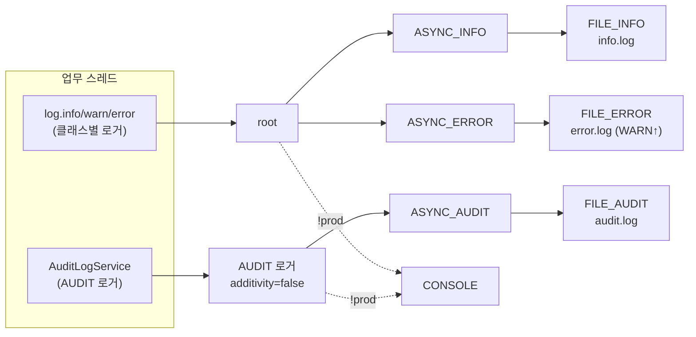
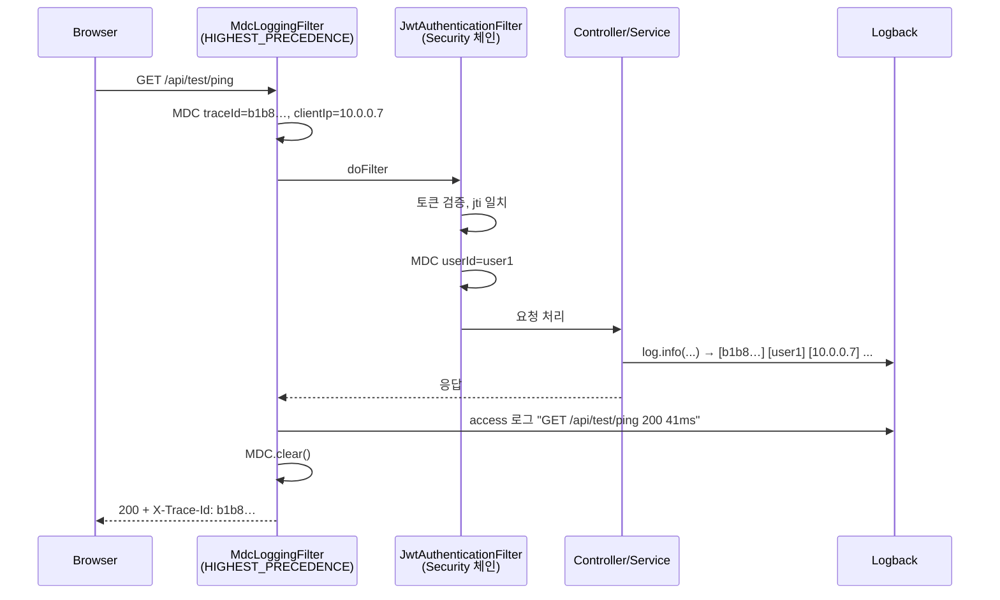
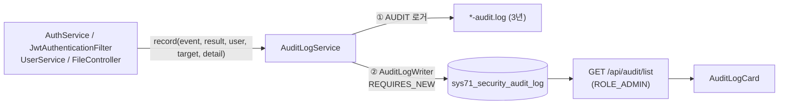

# AssetERP 차세대 로그(Logging) 아키텍처 및 상세 설계서

> 대상 프로젝트: `security-test/` (Spring Boot 3.4.3 / Java 21, Logback 1.5)
> 참고 자료: `docs/log-test.md` (Logback 파일 분리·비동기·MDC 가이드), 보안 설계: `docs/security-설계.md`

---

## 1. 개요 및 목적

엔터프라이즈 ERP에서 로그는 단순한 텍스트 출력이 아니라 다음 세 가지 요구를 만족해야 한다.

1. **장애 추적성 (Traceability)**: 사용자가 알려준 오류 한 건에서 해당 요청의 전체 로그를 바로 찾을 수 있어야 한다.
2. **성능 (디스크 I/O)**: 로그 쓰기가 업무 스레드를 막지 않아야 하고, 디스크가 로그로 가득 차지 않아야 한다.
3. **보안 감사 (Audit)**: 로그인·잠금·세션 차단·파일 반출 이력을 규정 기간 동안 보관하고 조회할 수 있어야 한다 (AS-IS `sys26_login` 대응).

### 1.1 핵심 요구사항

| # | 요구사항 | 구현 |
|:---|:---|:---|
| 1 | 목적별 로그 파일 분리 | `info` / `error` / `audit` 3개 파일, 종류별 보관 기간·용량 상한 |
| 2 | 비동기 로깅 | 모든 파일 appender를 `AsyncAppender`로 감쌈 |
| 3 | 날짜·크기 롤링 + 압축 | `SizeAndTimeBasedRollingPolicy`, `archived/yyyy-MM/*.log.gz` |
| 4 | 요청 추적 ID | `MdcLoggingFilter`가 요청마다 16자리 `traceId` 발급, `X-Trace-Id` 응답 헤더 |
| 5 | 로그 줄에 사용자·IP | MDC `userId`(인증 후), `clientIp` |
| 6 | 보안 감사 로그 | 파일(`*-audit.log`) + DB(`sys71_security_audit_log`) 이중 기록, 관리자 조회 화면 |
| 7 | 설정 외부화 | 경로·보관 기간·용량·큐 크기 모두 `application.properties`(`asseterp.log.*`) |
| 8 | 운영 콘솔 출력 차단 | `prod` 프로필에서는 콘솔 appender를 붙이지 않음 (Tomcat `catalina.out` 비대화 방지) |

---

## 2. 로그 파일 분리 및 보관 정책

| 구분 | 파일 | 기록 대상 | 보관 (기본) | 총 용량 상한 |
|:---|:---|:---|:---|:---|
| **애플리케이션** | `{app}-info.log` | root 로거 INFO 이상 전체 (WARN/ERROR 포함) | 30일 | 20GB |
| **에러** | `{app}-error.log` | WARN, ERROR만 (`ThresholdFilter`) | 90일 | 10GB |
| **감사** | `{app}-audit.log` | `AUDIT` 로거 전용 (`additivity=false`, info/error에 섞이지 않음) | 1095일 (3년) | 50GB |

- `{app}` = `asseterp.log.app-name` (기본 `${spring.application.name}` = `security-test-backend`)
- 경로 = `logging.file.path` (기본 `${asseterp.base.dir}/logs`)
- 롤링: 자정 또는 파일이 `max-file-size`(100MB)에 도달하면 `archived/2026-09/security-test-backend-info-2026-09-29.0.log.gz` 형태로 압축 이관된다. 같은 날 여러 번 롤링되면 끝 번호(`%i`)가 증가한다.
- 삭제: `max-history`(일)를 넘은 아카이브, 또는 종류별 아카이브 합계가 `total-size-cap`을 넘으면 오래된 것부터 삭제된다.

```
{logging.file.path}/
├── security-test-backend-info.log
├── security-test-backend-error.log
├── security-test-backend-audit.log
└── archived/
    └── 2026-09/
        ├── security-test-backend-info-2026-09-28.0.log.gz
        ├── security-test-backend-error-2026-09-28.0.log.gz
        └── security-test-backend-audit-2026-09-28.0.log.gz
```

---

## 3. Logback 구성 (`logback-spring.xml`)



### 3.1 로그 패턴

```
# info / error
%d{yyyy-MM-dd HH:mm:ss.SSS} [%X{traceId:-SYSTEM}] [%X{userId:--}] [%X{clientIp:--}] [%thread] %-5level %logger{36} - %msg%n

# audit (로거·스레드 없이 이벤트 한 줄)
%d{yyyy-MM-dd HH:mm:ss.SSS} [%X{traceId:-SYSTEM}] [%X{userId:--}] [%X{clientIp:--}] %msg%n
```

출력 예:

```
2026-09-29 15:34:25.019 [b1b8677b78c3eef5] [user1] [10.0.0.7] [http-nio-8080-exec-5] INFO  c.a.s.b.t.controller.TestController - 서버 통신 ping 호출 (#1) - user: user1, jti: 39ece87f-...
2026-09-29 15:34:25.022 [b1b8677b78c3eef5] [user1] [10.0.0.7] [http-nio-8080-exec-5] INFO  com.asseterp.security.access - GET /api/test/ping 200 41ms
2026-09-29 15:33:43.433 [SYSTEM] [-] [-] [main] INFO  c.a.security.SecurityTestApplication - Started SecurityTestApplication in 5.107 seconds
```

- 요청과 무관한 로그(기동, 스케줄러)는 `traceId`가 `SYSTEM`으로 표시된다.
- 인증 전 요청(로그인, 공개 경로)은 `userId`가 `-`로 표시된다.

### 3.2 비동기(Async) 설정

| 항목 | 값 | 이유 |
|:---|:---|:---|
| `queueSize` | 1024 (`asseterp.log.async.queue-size`) | 순간 트래픽 흡수용 버퍼 |
| `discardingThreshold` | 0 | 기본값은 큐가 80% 차면 INFO 이하를 **버린다**. 감사·업무 로그 유실 방지를 위해 0 |
| `includeCallerData` | false | 패턴에 호출 위치(`%L %M %C`)가 없으므로 수집 비용만 든다. 스택 트레이스는 이 옵션과 무관하게 출력된다 |
| `neverBlock` | false (기본) | 큐가 가득 차면 유실 대신 잠시 대기 |
| `maxFlushTime` | 5000ms (`asseterp.log.async.max-flush-time`) | 종료 시 큐에 남은 로그를 기록하기 위해 기다리는 최대 시간. Spring Boot가 종료 시 LoggerContext를 stop 한다 |

### 3.3 `docs/log-test.md` 대비 변경점

`log-test.md`의 템플릿을 그대로 적용하면 아래 문제가 있어 수정하여 반영했다.

| # | log-test.md | 문제 | 반영 |
|:---|:---|:---|:---|
| 1 | `archived/%d{yyyy-MM}/...-%d{yyyy-MM-dd}.%i.log.gz` | `%d`가 2개인데 하나를 `aux`로 표시하지 않으면 Logback이 기본 날짜 토큰을 결정하지 못해 롤링 설정 오류가 난다 | 월 디렉터리를 `%d{yyyy-MM,aux}`로 표시 |
| 2 | `APP_NAME` ← `logging.file.name` | Spring Boot에서 `logging.file.name`은 **파일 전체 경로**다. 앱 이름으로 쓰면 경로가 이중으로 붙는다 | `asseterp.log.app-name`(=`spring.application.name`) 사용, `logging.file.name`·`logging.logback.rollingpolicy.*` 제거 |
| 3 | 표에만 있는 감사 로그 | XML에 audit appender·logger가 없음 | `AUDIT` 로거 + `FILE_AUDIT` 추가, DB 이중 기록 |
| 4 | 에러 Async `includeCallerData=true` ("스택 추적용") | 패턴이 호출 위치를 출력하지 않아 오버헤드만 발생 | `false` |
| 5 | 패턴에 IP·사용자 없음, MDC 필터 설명과 코드 불일치 | MDC 필터는 Security보다 먼저 실행되어 사용자를 알 수 없음 | `clientIp`는 MDC 필터, `userId`는 인증 성공 시 `JwtAuthenticationFilter`가 MDC에 넣음 |
| 6 | `X-Trace-Id` 응답 헤더만 세팅 | CORS `exposedHeaders`에 없으면 브라우저 JS에서 읽을 수 없음 | CORS 노출 + 5xx 오류 메시지에 추적ID 표시 |
| 7 | traceId = UUID 앞 8자리 | 3년 보관 로그에서 충돌 가능 | 16자리 hex (64bit) |
| 8 | CONSOLE을 항상 root에 연결 | WAR를 Tomcat에 배포하면 롤링되지 않는 `catalina.out`이 무한히 커짐 | `<springProfile name="!prod">`에서만 정의·연결 |
| 9 | `scan="true"` | 운영 중 XML 재적재 시 `springProperty`/`springProfile`이 재해석되지 않을 수 있음 | 사용 안 함 (레벨 변경은 properties 수정 후 재시작) |
| 10 | 보관 기간·용량 하드코딩 | 설정 외부화 방침 위반 | `asseterp.log.*` |
| 11 | 로그 디렉터리 `chmod 755` | 로그에 사용자 ID·IP(개인정보)가 포함됨 | 750 이하 권장 (7장) |

> `<springProfile>`은 `<root>`/`<logger>` 안에 중첩할 수 없다 (Spring Boot가 경고 후 무시). 그래서 `!prod` 블록 안에서 `CONSOLE` appender를 정의하고, `<root>`와 `<logger name="AUDIT">`를 다시 선언해 appender만 추가한다. CONSOLE을 블록 밖에 정의하면 prod에서 "참조되지 않은 appender" 경고가 나고, 그 경고 때문에 Logback 내부 상태 로그 전체가 콘솔에 출력된다.

---

## 4. 요청 추적 (MDC)

### 4.1 흐름



### 4.2 MDC 키

| 키 | 설정 위치 | 값 |
|:---|:---|:---|
| `traceId` | `MdcLoggingFilter` | 요청마다 16자리 hex. 응답 헤더 `X-Trace-Id`(`asseterp.log.trace-header`)로도 전달 |
| `clientIp` | `MdcLoggingFilter` | `request.getRemoteAddr()` |
| `userId` | `JwtAuthenticationFilter` (jti 일치로 인증 성공 시) | 로그인 아이디 (`username`) |

- MDC 정리는 가장 바깥의 `MdcLoggingFilter`가 `finally`에서 `MDC.clear()`로 한 번에 처리한다 (스레드 풀 재사용 시 이전 요청 값 오염 방지).
- **프록시 뒤 배치 시**: `X-Forwarded-For`를 직접 신뢰하면 IP를 위조할 수 있다. 앞단 프록시가 확정되면 `server.forward-headers-strategy=native`(또는 Tomcat `RemoteIpValve`)로 신뢰할 프록시에서 온 헤더만 반영한다.

### 4.3 요청 종료 로그 (access)

- 로거: `com.asseterp.security.access` (INFO) → info 파일
- 형식: `{method} {uri} {status} {elapsed}ms`
- `asseterp.log.request-log.enabled=false`로 끌 수 있고, 정적 리소스는 `asseterp.log.request-log.exclude-paths`로 제외한다.

### 4.4 화면 연동

- 5xx 응답: 서버 메시지에 추적ID를 포함한다 (`서버 내부 오류가 발생했습니다. (추적ID: b1b8…)`).
- 프론트엔드 `errorMessage(err)`(`api/client.ts`)는 5xx 응답이면 `X-Trace-Id` 헤더 값을 메시지에 덧붙인다.
- 사용자가 추적ID를 알려주면 운영자는 `grep b1b8… *-info.log`로 해당 요청의 전체 로그를 찾는다.

---

## 5. 보안 감사 로그 (Audit)

### 5.1 이중 기록 구조



- **① 파일 먼저, ② DB 나중**: DB 등록이 실패해도 예외를 전파하지 않고 `log.error`만 남긴다 (파일 기록은 이미 완료). 감사 기록 실패가 업무(로그인 등)를 막지 않는다.
- **별도 트랜잭션**: 로그인 실패처럼 기록 직후 예외가 발생해 업무 트랜잭션이 롤백되어도 감사 기록은 남아야 한다. `AuditLogWriter.insert()`는 `REQUIRES_NEW`로 커밋한다. 예외를 잡을 수 있도록 트랜잭션 경계를 별도 빈(`AuditLogWriter`)으로 분리했다.
- **로그 위조 방지**: 아이디 등 사용자 입력의 줄바꿈·탭을 공백으로 바꾸고 `"`를 `'`로 바꾼다. 컬럼 길이에 맞춰 자른다. 입력에 `\nevent=LOGIN_SUCCESS`를 넣어 가짜 줄을 만드는 공격을 막는다.
- **민감정보 금지**: 비밀번호, 토큰 원문은 기록하지 않는다. 세션 식별자(`jti`, `rid`)만 기록한다.

### 5.2 감사 이벤트

| 이벤트 (`event_type`) | 결과 | 기록 위치 | 행위자 / 대상 / 상세 |
|:---|:---|:---|:---|
| `LOGIN_SUCCESS` | SUCCESS | `AuthService.login` | 사용자 / - / `jti=…` |
| `LOGIN_FAIL` | FAIL | `AuthService.login` | 입력한 아이디 / - / `없는 아이디` 또는 `비밀번호 불일치 (1/2)` |
| `ACCOUNT_LOCKED` | FAIL | `AuthService.login` | 사용자 / - / `로그인 2회 연속 실패` |
| `LOGIN_LOCKED_ATTEMPT` | FAIL | `AuthService.login` | 잠긴 계정으로 로그인 시도 |
| `ACCOUNT_UNLOCKED` | SUCCESS | `UserService.updateUserUnlock` | 처리 관리자 / 해제 대상 사용자 |
| `LOGOUT` | SUCCESS | `AuthService.logout` | 활성 세션을 종료한 경우만 |
| `MULTI_LOGIN_BLOCKED` | FAIL | `JwtAuthenticationFilter`, `AuthService.refresh` | 사용자 / - / 차단된 요청(`GET /api/test/ping`) 또는 `Refresh 차단` |
| `TOKEN_REUSED` | FAIL | `AuthService.refresh` | 사용자 / - / `세션 폐기, jti=…, rid=…` |
| `SESSION_EXPIRED` | SUCCESS | `SessionExpiryAuditListener` (Redis 만료 이벤트) | 사용자 / - / `유휴 시간 초과 (Redis 세션 TTL 만료)`. 실제 세션 종료 시각, IP·브라우저 없음 (5.5) |
| `REFRESH_REJECTED` | FAIL | `AuthService.refresh` | 사용자 / - / `REFRESH_EXPIRED: …` 또는 `SESSION_NOT_FOUND: …`. 만료 후 다시 요청한 시점 (5.5) |
| `FILE_UPLOAD` | SUCCESS | `FileController.uploadFile` | 사용자 / 파일ID / `원본명 (크기, MIME)` |
| `FILE_UPLOAD_REJECTED` | FAIL | `FileController.uploadFile` | 사용자 / 원본 파일명 / 거부 사유 |
| `FILE_DOWNLOAD` | SUCCESS | `FileController.downloadFile` | 사용자 / 파일ID / 원본명 |
| `WS_CONNECT` | SUCCESS | `PresenceService.onConnected` | 사용자 / WebSocket 세션ID / `instance=…` (`docs/websocket-설계.md`) |
| `WS_DISCONNECT` | SUCCESS | `PresenceService.onDisconnected` | 사용자 / WebSocket 세션ID / `closeStatus=…` |
| `WS_FORCED_CLOSE` | SUCCESS | `WsSessionTerminator.terminate` | 사용자 / WebSocket 세션ID / 종료 사유(`MULTI_LOGIN`, `LOGOUT`, `EXPIRED` …). 추적ID는 원인 요청(로그인 등)과 같음 |
| `NOTICE_BROADCAST` | SUCCESS | `PushService.createNotice` | 발송 관리자 / 메시지ID / 제목 |
| `NOTIFICATION_SEND` | SUCCESS | `PushService.createNotification` | 발송 관리자 / 받는 사용자 / 제목 |

audit 파일 예:

```
2026-09-29 15:34:24.744 [3189c2236f48f91b] [-] [10.0.0.7] event=LOGIN_FAIL result=FAIL user=user1 target=- detail="비밀번호 불일치 (1/2)"
2026-09-29 15:34:36.946 [660703f669c9acae] [-] [10.0.0.7] event=ACCOUNT_LOCKED result=FAIL user=user1 target=- detail="로그인 2회 연속 실패"
2026-09-29 15:34:55.148 [246abcafcec2060a] [admin] [10.0.0.7] event=ACCOUNT_UNLOCKED result=SUCCESS user=admin target=user1 detail=""
2026-09-29 15:34:55.207 [335431b827c748ca] [-] [10.0.0.7] event=MULTI_LOGIN_BLOCKED result=FAIL user=user1 target=- detail="GET /api/test/ping"
```

### 5.3 테이블 (`sys71_security_audit_log`)

```sql
CREATE TABLE sys71_security_audit_log (
    audit_id    BIGSERIAL    PRIMARY KEY,
    event_type  VARCHAR(40)  NOT NULL,             -- AuditEventType
    result      VARCHAR(10)  NOT NULL,             -- SUCCESS / FAIL
    user_id     VARCHAR(50),                       -- 행위자 로그인 아이디 (app_user.username)
    target_id   VARCHAR(100),                      -- 대상 (잠금 해제 대상 사용자, 파일ID 등)
    detail      VARCHAR(500),
    client_ip   VARCHAR(45),                       -- IPv6 최대 길이
    user_agent  VARCHAR(300),
    trace_id    VARCHAR(32),                       -- X-Trace-Id (애플리케이션 로그와 연결)
    created_at  TIMESTAMP    NOT NULL DEFAULT now()
);
CREATE INDEX idx_sys71_security_audit_log_user    ON sys71_security_audit_log (user_id, created_at);
CREATE INDEX idx_sys71_security_audit_log_created ON sys71_security_audit_log (created_at);
```

- 로컬 PostgreSQL(도커 컨테이너 `t3600_postgres`, `localhost:5432/asseterpdb`)에 생성되어 있다. 다른 환경에는 위 DDL을 실행해 생성한다.

| AS-IS `sys26_login` | TOBE `sys71_security_audit_log` |
|:---|:---|
| 로그인 이력 중심 | 로그인 + 잠금/해제 + 세션 차단 + 토큰 재사용 + 파일 업/다운로드 |
| - | `trace_id`로 애플리케이션 로그(info/error)와 연결 |

### 5.4 조회

- API: `GET /api/audit/list?limit=100` (`ROLE_ADMIN`, 최대 1000건, 최신순)
- 화면: admin 로그인 시 메인 페이지의 **보안 감사 로그** 카드(`AuditLogCard`). 이벤트별 색상 태그를 보여 주고, IP에 마우스를 올리면 User-Agent를, 추적ID는 복사 버튼을 제공한다.

### 5.5 세션 만료 기록

세션 만료는 Redis 세션 키의 TTL이 끝나 조용히 사라지는 것이라, 별도 장치 없이는 서버가 알아차리는 시점이 없다. 두 가지 방식을 함께 사용한다.

| | ① 갱신 거부 시점 (`REFRESH_REJECTED`) | ② Redis 만료 이벤트 (`SESSION_EXPIRED`) |
|:---|:---|:---|
| 기록 시점 | 만료 후 사용자가 다시 요청할 때 (화면 타이머 0, 새로고침, 재방문) | 세션 키가 만료되는 순간 |
| 브라우저를 닫고 떠난 경우 | 기록 안 됨 | 기록됨 |
| IP·브라우저 | 있음 | 없음 (요청 밖) |
| 누락 가능성 | 쿠키 여유시간(10분) 이후 재방문하면 쿠키가 없어 사용자를 알 수 없음 | 만료 순간 앱이 내려가 있으면 이벤트 유실 (Pub/Sub은 저장되지 않음) |

**① 갱신 거부 시점**
- 쿠키 Max-Age를 `Refresh 수명 + jwt.cookie.max-age-margin(10분)`으로 두어, 토큰이 만료된 뒤에도 쿠키가 서버에 도착하게 한다. 쿠키가 토큰과 함께 사라지면 서버는 누구의 세션인지 알 수 없다.
- 만료 예외(`ExpiredJwtException`)에서도 서명 검증된 Claims를 얻을 수 있으므로, `typ=REFRESH`를 확인한 뒤 사용자를 기록한다.
- 프론트엔드는 세션 타이머가 0이 되면 `/api/auth/refresh`를 한 번 호출해 서버가 만료를 판정하게 한다(다른 탭에서 세션이 연장됐다면 이어서 사용).

**② Redis 만료 이벤트**
- 채널 `__keyevent@{db}__:expired`를 구독하고, 활성 세션 키(`security:user:jti:{userId}`)만 처리한다. `rid`, `rid-prev`, 로그인 실패 횟수 키의 만료는 무시한다.
- 로그인(덮어쓰기), 갱신(TTL 연장), 로그아웃·재사용 탐지(삭제)는 만료 이벤트를 만들지 않는다. 그래서 **유휴 시간 초과로 끝난 세션만** 기록된다.
- 서버가 여러 대면 모든 서버가 같은 이벤트를 받는다. `SET NX security:audit:session-expired:{userId}` (10초)를 먼저 잡은 서버 한 대만 기록한다.
- 리스너 스레드에서 추적ID를 새로 발급하므로 해당 로그 줄과 감사 기록이 연결된다.
- Redis 부하: 만료 이벤트(`x`)만 발행하므로 일반 명령에는 비용이 없다. 모든 이벤트를 켜는 `KEA`는 사용하지 않는다.
- 두 방식이 모두 동작하면 한 번의 만료에 `SESSION_EXPIRED`(종료 시각)와 `REFRESH_REJECTED`(재요청 시각)가 각각 남는다. 뜻이 다르므로 둘 다 유지한다.

**Redis 설정 (필수)**

Redis 서버에 `notify-keyspace-events Ex`가 설정되어 있어야 이벤트가 발행된다. 설정이 없어도 오류는 나지 않고, 이벤트가 오지 않아 ②만 기록되지 않는다.

- 로컬 `t3600_redis`는 `--rename-command CONFIG ""`로 `CONFIG` 명령이 막혀 있다. 그래서 앱이 `CONFIG SET`으로 설정을 바꿀 수 없고, 컨테이너 기동 옵션에 추가해야 한다.

```bash
redis-server --requirepass ... --appendonly yes \
  --rename-command FLUSHALL "" --rename-command FLUSHDB "" --rename-command CONFIG "" \
  --notify-keyspace-events Ex
```

- 끄려면 `asseterp.audit.session-expiry.enabled=false`로 설정한다. 이 값이 false면 구독 자체를 하지 않는다.

---

## 6. 설정 항목 (`application.properties`)

```properties
logging.file.path=${asseterp.base.dir}/logs          # 로그 디렉터리
asseterp.log.app-name=${spring.application.name}      # 파일명 접두사

asseterp.log.info.max-history=30                     # 보관 일수
asseterp.log.info.max-file-size=100MB                # 이 크기에 도달하면 롤링
asseterp.log.info.total-size-cap=20GB                # 아카이브 총 용량 상한
asseterp.log.error.max-history=90
asseterp.log.error.max-file-size=100MB
asseterp.log.error.total-size-cap=10GB
asseterp.log.audit.max-history=1095                  # 3년
asseterp.log.audit.max-file-size=100MB
asseterp.log.audit.total-size-cap=50GB

asseterp.log.async.queue-size=1024
asseterp.log.async.max-flush-time=5000               # ms

jwt.cookie.max-age-margin=10m                        # 쿠키 수명 여유시간 (만료 세션 판정, 5.5 ①)
asseterp.audit.session-expiry.enabled=true           # Redis 만료 이벤트 구독 (5.5 ②)
asseterp.audit.session-expiry.dedup-key-prefix=security:audit:session-expired:
asseterp.audit.session-expiry.dedup-ttl=10s

asseterp.log.trace-header=X-Trace-Id
asseterp.log.request-log.enabled=true
asseterp.log.request-log.exclude-paths=/,/index.html,/assets/**,/favicon.ico,/*.js,/*.css,/*.png,/*.svg

logging.level.root=INFO
logging.level.com.asseterp.security=DEBUG
logging.level.com.asseterp.security.access=INFO
```

- 파일 보관 정책(`info/error/audit/async`)은 `logback-spring.xml`이 `<springProperty>`로 직접 읽는다.
- `trace-header`, `request-log.*`는 `LogProperties` 레코드로 바인딩되어 `MdcLoggingFilter`·CORS 설정에서 사용한다.
- 명령행에서 바꿀 수 있다. 예: `--asseterp.log.info.max-file-size=10KB` (롤링 동작 확인용)

---

## 7. 운영 가이드

### 7.1 프로필

| 프로필 | 콘솔 | 파일 3종 |
|:---|:---|:---|
| 기본 (개발, `bootRun`) | 출력 | 기록 |
| `prod` (Tomcat WAR) | 출력 안 함 (Spring 배너만 출력) | 기록 |

- Tomcat 배포 시 `spring.profiles.active=prod`를 지정한다. 예: `CATALINA_OPTS="-Dspring.profiles.active=prod"` 또는 `setenv.sh`.
- 같은 Tomcat에 여러 WAR를 배포하면 `asseterp.log.app-name`을 앱마다 다르게 두어 파일이 섞이지 않게 한다.

### 7.2 디렉터리 권한

- 로그에는 사용자 ID·IP·파일명(개인정보)이 포함된다. 로그 디렉터리는 **실행 계정 전용 750(또는 700)**으로 두고, 조회 권한이 필요한 운영자만 그룹에 넣는다.

```bash
chown tomcat:asseterp-ops /data/asseterp-data/logs
chmod 750 /data/asseterp-data/logs
```

### 7.3 장애 추적 절차

1. 사용자가 오류 화면의 추적ID(예: `b1b8677b78c3eef5`)를 전달한다.
2. `grep b1b8677b78c3eef5 security-test-backend-info.log`로 해당 요청의 전체 로그와 access 줄(상태 코드, 소요 시간)을 확인한다.
3. 스택 트레이스는 `security-test-backend-error.log`에서 같은 추적ID로 찾는다.
4. 보안 이벤트였다면 `select * from sys71_security_audit_log where trace_id = 'b1b8677b78c3eef5'`로 감사 기록을 확인한다.

### 7.4 검증 결과 (2026-09-29)

| 항목 | 결과 |
|:---|:---|
| 기동 시 Logback 설정 경고/오류 | 없음 (개발·prod 프로필 모두) |
| 파일 3종 생성, info에 AUDIT 줄 없음, error에 WARN 이상만 | 확인 |
| `X-Trace-Id` 헤더 = 로그 `traceId`, 인증 후 로그에 `userId` 표시 | 확인 |
| 감사 이벤트 파일·DB 동시 기록 (로그인 실패는 예외 롤백 후에도 DB에 남음) | 확인 |
| `/api/audit/list` admin 200 / user1 403 | 확인 |
| `max-file-size=10KB`로 롤링 → `archived/2026-09/…-2026-09-29.{0..5}.log.gz` | 확인 |
| `prod` 프로필 콘솔 출력 | Spring 배너만 출력 |
| 세션 만료 ② (Ex 설정한 임시 Redis, 세션 15초) | 로그인 15초 뒤 `SESSION_EXPIRED` 기록 (IP 없음, 추적ID 발급) |
| 세션 만료 ① (만료 후 쿠키로 갱신 시도) | 쿠키 `Max-Age=615`(15초+10분), 401 `REFRESH_EXPIRED` + `REFRESH_REJECTED` 기록 |
| 서버 2대 동시 구독 | `SESSION_EXPIRED` 1건만 기록 (dedup) |

### 7.5 자동 테스트

| 테스트 | 검증 내용 |
|:---|:---|
| `AuditLogServiceTest` | MDC의 추적ID·IP를 DB 레코드에 반영, DB 실패 시 예외 미전파, 줄바꿈 제거·길이 제한 |
| `MdcLoggingFilterTest` | 요청 중 MDC 값, 응답 헤더와 추적ID 일치, 요청 후 MDC 비움, 요청마다 다른 ID |
| `AuthServiceTest` | 로그인 성공·실패·잠금·잠긴 계정 시도·토큰 재사용·갱신 거부(만료 토큰, 세션 없음) 시 감사 이벤트 기록 |
| `SessionExpiryAuditListenerTest` | 세션 키 만료 시 기록, 다른 키(`rid`·실패 횟수) 무시, 다른 서버가 기록했으면 생략 |

---

## 8. 파일 구조

```
security-test/backend/src/main/
├── java/com/asseterp/security/
│   ├── common/
│   │   ├── log/
│   │   │   ├── MdcLoggingFilter.java        # traceId·clientIp MDC, X-Trace-Id, access 로그
│   │   │   └── MdcKeys.java                 # MDC 키 상수
│   │   ├── config/properties/LogProperties.java  # asseterp.log.* (trace-header, request-log)
│   │   ├── config/properties/AuditProperties.java# asseterp.audit.* (session-expiry)
│   │   ├── jwt/JwtAuthenticationFilter.java # 인증 성공 시 MDC userId, 동시 로그인 차단 감사
│   │   └── error/GlobalExceptionHandler.java# 500 메시지에 추적ID
│   └── biz/audit/
│       ├── controller/AuditLogController.java    # GET /api/audit/list (ROLE_ADMIN)
│       ├── service/AuditLogService.java          # 파일 + DB 이중 기록
│       ├── service/AuditLogWriter.java           # DB 등록 (REQUIRES_NEW)
│       ├── service/SessionExpiryAuditListener.java # Redis 세션 키 만료 이벤트 → SESSION_EXPIRED
│       ├── service/SessionExpiryAuditConfig.java   # __keyevent@{db}__:expired 구독 (asseterp.audit.session-expiry.enabled)
│       ├── mapper/AuditLogMapper.java
│       └── dto/                                  # AuditEventType, AuditResult, AuditLogRecord
└── resources/
    ├── logback-spring.xml
    └── mapper/AuditLogMapper.xml

security-test/frontend/src/
├── api/audit.ts                    # 감사 로그 조회
├── api/client.ts                   # errorMessage(): 5xx에 추적ID 표시
└── components/AuditLogCard.tsx     # 보안 감사 로그 카드 (관리자)
```

---

## 9. 향후 과제

| 구분 | 현재 | 개선 방향 |
|:---|:---|:---|
| 로그 수집·검색 | 서버별 파일 grep | Spring Boot 3.4 구조화 로그(`logging.structured.format.file=ecs`)로 JSON 출력 → ELK/Loki 연동 |
| 감사 로그 무결성 | 파일·DB 모두 관리자가 수정 가능 | 해시 체인(이전 행 해시 포함), WORM 스토리지, 원격 syslog 전송 |
| 감사 테이블 보관 | 무기한 누적 | 월 단위 파티셔닝, 보관 기간이 지난 데이터 이관·삭제 배치 |
| 런타임 레벨 변경 | 재시작 필요 | `spring-boot-starter-actuator`의 `/actuator/loggers` (ADMIN 보호) |
| 개인정보 마스킹 | 개발자 규칙에 의존 | Logback `MessageConverter`로 주민번호·계좌번호 패턴 마스킹 |
| 동시 로그인 차단 감사 중복 | 차단된 세션이 요청할 때마다 1건씩 기록 | 필요 시 세션(jti)당 1회만 기록 |
| 기록하지 않는 보안 이벤트 | 위조·변조 토큰(`INVALID_TOKEN`)은 WARN 로그만, 권한 없는 호출(403 `ACCESS_DENIED`)은 기록 없음 | 공격 시도 신호이므로 감사 이벤트로 추가 |
| 세션 만료 이벤트 유실 | 만료 순간 앱이 내려가 있으면 `SESSION_EXPIRED` 누락 | 기동 시 마지막 로그인 이후 종료 기록이 없는 세션을 보정하는 배치 (필요 시) |
| 감사 로그 조회 | 최근 N건 | 기간·사용자·이벤트 조건 검색, 엑셀 다운로드 |
| Spring 기본 경고 | `UserDetailsServiceAutoConfiguration`의 "generated security password" WARN이 error 로그에 남음 | 해당 자동 설정 제외 (JWT 인증만 사용) |
