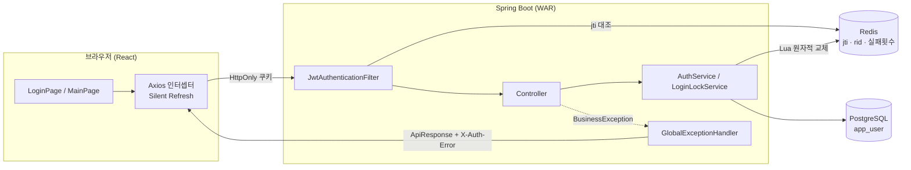
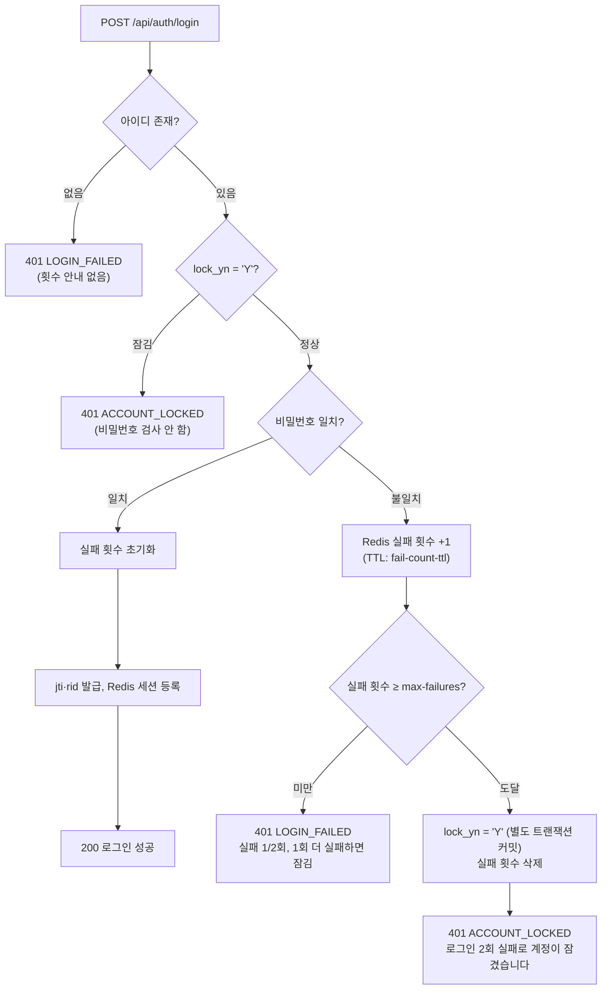
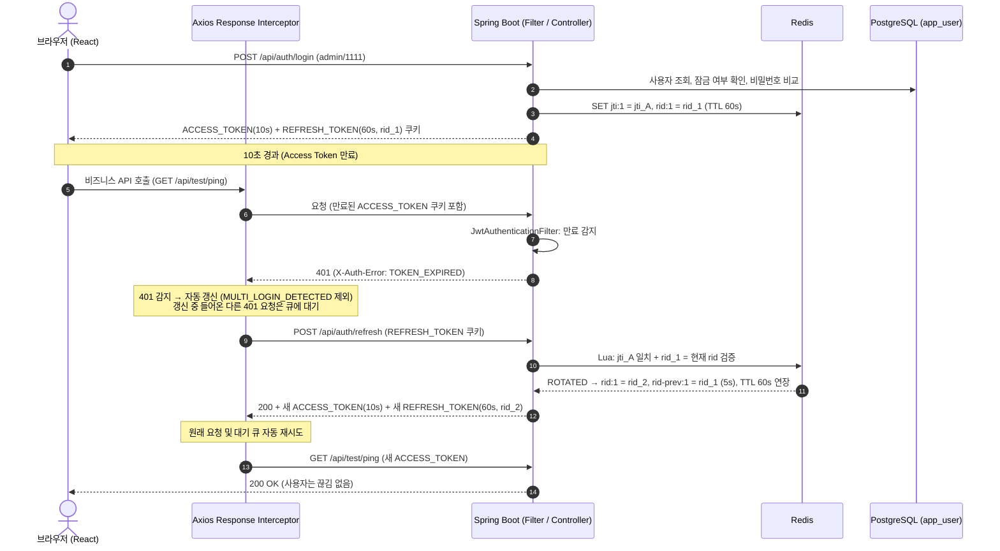
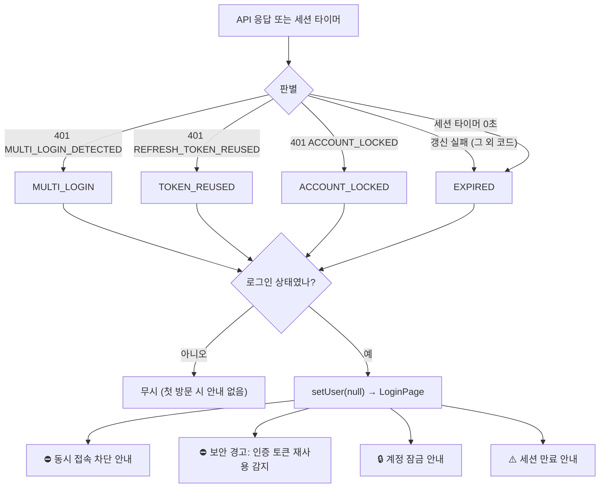

# AssetERP 차세대 보안(Security) 아키텍처 및 상세 설계서

> **프로젝트**: AssetERP 차세대 전환 보안 프로토타입 (`security-test`)  
> **기준 일자**: 2026-09-29  
> **대상 환경**: Java 21 (LTS) / Spring Boot 3.4.3 / Spring Security 6.x / React 19 / Ant Design 5.x / PostgreSQL 15 / Redis 7.x / Tomcat 10.1 (WAR)

---

## 1. 개요 및 목적

본 문서는 레거시 자산운용사 ERP(GWT/GXT, Java 8 기반)를 **Spring Boot + React** 스택으로 전환함에 있어, 시스템의 핵심 보안 요구사항을 충족하기 위한 **JWT 기반 인증·인가, Redis 연동 동시(멀티) 로그인 차단, 이중 토큰 자동 갱신(Silent Refresh), Refresh Token 재사용 탐지, 로그인 실패 잠금, 파일 업로드 바이너리 위변조 검증(Apache Tika)**의 아키텍처와 상세 구현 내용을 정리한 문서이다.

### 1.1 핵심 요구사항

1. **JWT & HttpOnly 쿠키 인증**: XSS로 토큰이 탈취되지 않도록 토큰을 자바스크립트 접근이 불가한 `HttpOnly` 쿠키로만 전달한다. 응답 본문에도 토큰을 담지 않는다.
2. **이중 토큰(Access / Refresh) 구조**:
   - `Access Token`: 10초 (탈취 피해 최소화)
   - `Refresh Token`: 60초 (무중단 작업 보장, 세션 유휴 만료 시간)
3. **무중단 자동 갱신 (Silent Refresh & Sliding Session)**:
   - Access Token이 만료되면 프론트엔드 Axios 인터셉터가 백그라운드에서 Refresh Token으로 자동 갱신하여 사용자는 끊김 없이 작업을 이어간다.
   - 갱신할 때마다 Access Token과 Refresh Token을 모두 재발급하여, 통신이 이어지는 한 세션이 계속 연장된다(Sliding Session).
4. **동시(멀티) 로그인 즉시 차단 (JTI 기반)**:
   - 다른 기기/브라우저에서 동일 계정으로 로그인하면 Redis의 활성 `JTI`를 갱신하여 **이전 브라우저의 접속을 차단**한다 (`MULTI_LOGIN_DETECTED`).
5. **Refresh Token 교체(Rotation) 및 재사용 탐지**:
   - 갱신할 때마다 Refresh Token을 새 ID(`rid`)로 교체하고, 이미 교체된 토큰이 다시 사용되면 탈취로 판단하여 **세션 전체를 폐기**한다 (`REFRESH_TOKEN_REUSED`).
6. **로그인 실패 잠금 (AS-IS 방식)**:
   - 연속 로그인 실패가 설정 횟수(기본 2회)에 도달하면 계정을 **영구 잠금**(`app_user.lock_yn='Y'`)하고, 관리자만 해제할 수 있다.
7. **예외 시 자동 리다이렉트 및 사유 안내**:
   - 세션 만료, 동시 접속 차단, 토큰 재사용 탐지, 계정 잠금으로 세션이 종료되면 즉시 로그인 화면으로 이동하고 사유를 안내 배너(`Alert`)로 표시한다.
8. **Apache Tika 기반 Magic Number MIME 검증**:
   - 파일 업로드 시 확장자 위변조(예: `.exe`를 `.png`로 변경)를 파일의 바이너리 매직 넘버로 판별하여 **저장 전에 거부**한다.
9. **WAR 배포 및 퍼블릭 리소스 허용**:
   - `SpringBootServletInitializer` 상속, Tomcat 10.1 컨텍스트 경로(`/security-test/`) 배포, SPA 정적 리소스 / 퍼블릭 API 허용.
10. **설정 외부화**:
    - 토큰 수명, 쿠키 속성, 잠금 횟수, 허용 파일 형식, CORS 등 운영 중 바뀔 수 있는 값은 모두 `application.properties`로 관리한다.

---

## 2. 시스템 아키텍처 및 기술 스택

### 2.1 기술 스택 명세

| 구분 | 기술 / 라이브러리 | 버전 | 라이선스 | 역할 |
|:---|:---|:---|:---|:---|
| **Language** | Java | `21 (LTS)` | Eclipse Temurin | Records, 패턴 매칭, switch 식 등 최신 기능 활용 |
| **Framework** | Spring Boot | `3.4.3` | Apache-2.0 | 백엔드 애플리케이션 프레임워크 (jakarta.*) |
| **Security** | Spring Security | `6.4.x` | Apache-2.0 | `SecurityFilterChain` Bean, Lambda DSL, `@PreAuthorize` 메서드 보안 |
| **Token** | JJWT | `0.12.6` | Apache-2.0 | HMAC-SHA256 기반 JWT 생성, 파싱, 서명·발급자 검증 |
| **Database** | PostgreSQL | `15.x / 16.x` | PostgreSQL License | 사용자 정보(`app_user`) 및 계정 잠금 상태 저장 |
| **Cache/Session**| Redis | `7.x` | BSD-3-Clause | 활성 `JTI`·`rid` 세션 관리, Lua 스크립트 원자적 토큰 교체, 로그인 실패 횟수 |
| **ORM/SQL** | MyBatis | `3.0.4` | Apache-2.0 | XML 기반 SQL 매핑 및 카멜케이스 자동 변환 |
| **MIME 검증** | Apache Tika (`tika-core`) | `2.9.2` | Apache-2.0 | 파일 바이너리 Magic Number 기반 실제 MIME 타입 판별 |
| **Packaging** | WAR (bootWar) | - | - | 외장 WAS (Apache Tomcat 10.1) 배포 지원 |
| **Frontend** | React / TypeScript | `19.x / 5.7` | MIT / Apache-2.0 | UI 컴포넌트 아키텍처 및 엄격한 타입 안정성 |
| **Build Tool** | Vite | `6.x` | MIT | HMR 개발 서버 및 프로덕션 번들러 |
| **UI Library** | Ant Design | `5.24.x` | MIT | Form, Table, Progress, Alert, Popconfirm 컴포넌트 |
| **HTTP Client** | Axios | `1.7.x` | MIT | `withCredentials` 쿠키 송수신 및 자동 재발급 인터셉터 |

### 2.2 구성도



---

## 3. 세부 설계 및 동작 원리

### 3.1 JWT Payload 규격

JWT의 `sub` 클레임은 `user_id`를 의미하며, `typ` 클레임으로 Access/Refresh 토큰을 구분한다. 두 토큰은 같은 세션 식별자(`jti`)를 공유한다.

**Access Token**

```json
{
  "iss": "asset-erp",
  "sub": "1",
  "jti": "18bb2206-01c8-4630-bc18-86fea8f82daf",
  "iat": 1790654992,
  "exp": 1790655002,
  "typ": "ACCESS",

  "username": "admin",
  "name": "시스템 관리자",
  "company_id": 100,
  "dept_id": "D101",
  "roles": ["ROLE_ADMIN"]
}
```

**Refresh Token**

```json
{
  "iss": "asset-erp",
  "sub": "1",
  "jti": "18bb2206-01c8-4630-bc18-86fea8f82daf",
  "iat": 1790654992,
  "exp": 1790655052,
  "typ": "REFRESH",
  "rid": "05eef01c-4b36-48a1-9d0e-3c1f0a7b2e11"
}
```

| 클레임 | 설명 |
|:---|:---|
| `jti` | 세션 식별자. 로그인 시 생성되어 세션이 끝날 때까지 유지된다. 동시 로그인 차단에 사용 (3.3) |
| `typ` | `ACCESS` / `REFRESH`. 다른 타입의 토큰을 사용하면 `INVALID_TOKEN`으로 거부된다 |
| `rid` | Refresh Token 고유 ID. 갱신할 때마다 새로 발급되며 재사용 탐지에 사용 (3.4) |
| `dept_id` | `app_user`에 부서 컬럼이 없어 `asseterp.auth.default-dept-id` 설정값(`D101`)을 사용 |

토큰 검증 시 서명, 발급자(`iss`), 만료(`exp`), 토큰 타입(`typ`)을 모두 확인한다 (`JwtTokenProvider.parseClaims`).

### 3.2 이중 쿠키 정책

| 쿠키 이름 | 토큰 수명 (JWT `exp`) | 쿠키 Max-Age | 보안 속성 | 용도 |
|:---|:---|:---|:---|:---|
| `ACCESS_TOKEN` | **10초** (`jwt.access-token-expiration`) | 60초 + 10분 | `HttpOnly`, `SameSite=Lax`, `Path={context}/` | 모든 보호된 API 인가 |
| `REFRESH_TOKEN` | **60초** (`jwt.refresh-token-expiration`) | 60초 + 10분 | `HttpOnly`, `SameSite=Lax`, `Path={context}/api/auth` | 토큰 재발급·로그아웃에만 전송 |

- **쿠키 Max-Age = Refresh 수명 + 여유시간(`jwt.cookie.max-age-margin`, 기본 10분)인 이유**:
  - Access Token의 JWT가 만료돼도 쿠키는 서버로 전송되므로, 서버가 `TOKEN_EXPIRED`와 `MULTI_LOGIN_DETECTED`를 구분해 응답할 수 있다.
  - 세션(Refresh Token)이 만료된 뒤에도 여유시간 동안은 쿠키가 남아, 서버가 **누구의 세션이 만료됐는지** 판정하고 감사 로그(`REFRESH_REJECTED`)에 기록할 수 있다. 여유시간이 없으면 쿠키가 토큰과 함께 사라져 서버에는 토큰 없는 요청(`UNAUTHORIZED`)만 도착한다.
  - 토큰 자체의 유효성은 JWT `exp`로 검증하므로, 만료된 토큰이 담긴 쿠키가 남아 있어도 보안상 영향은 없다.
- **세션 만료 시 프론트엔드**: 세션 타이머가 0이 되면 바로 로그인 화면으로 보내지 않고 `/api/auth/refresh`를 한 번 호출한다. 서버가 만료를 판정·기록하고 401 `REFRESH_EXPIRED`로 응답하면 인터셉터가 로그인 화면으로 이동한다. 다른 탭에서 세션이 연장되어 있었다면 갱신에 성공하여 그대로 이어서 사용한다.
- **Refresh 쿠키 경로 제한**: `REFRESH_TOKEN`은 `/api/auth` 이하(갱신·로그아웃)에서만 전송되어 일반 API 요청에 노출되지 않는다.
- **응답 본문에 토큰 미포함**: 로그인/갱신/내 정보 응답(`LoginRes`)은 사용자 정보와 수명 정보만 반환한다.

  | 필드 | 설명 |
  |:---|:---|
  | `accessTokenExpiresIn` / `refreshTokenExpiresIn` | 응답 시점 기준 남은 수명(ms). 클라이언트 시계 오차의 영향을 받지 않는다 |
  | `accessTokenLifetime` / `refreshTokenLifetime` | 설정된 전체 수명(ms). 화면 게이지·안내 문구 계산용 |

- **쿠키 설정**: 이름·`SameSite`·Refresh 쿠키 경로·`Secure`는 `jwt.cookie.*`로 설정한다. 운영(HTTPS)에서는 `jwt.cookie.secure=true`로 설정한다.

> **보안 이점**: 토큰이 `document.cookie`, `localStorage`, 응답 본문 어디에도 노출되지 않으므로 XSS로 토큰 값을 탈취할 수 없다. (단, XSS가 발생하면 탈취 없이도 사용자 권한으로 요청을 보낼 수 있으므로 XSS 방어 자체는 별도로 필요하다.)

### 3.3 동시(멀티) 로그인 차단 (JTI 기반)

동시 로그인을 차단하고 이전 세션을 즉시 무효화하기 위해 **Redis에 사용자별 활성 `jti`를 매핑**한다 (Redis 키 전체 목록은 4.2 참조).

1. **새 로그인 시**: 신규 `jti`와 `rid`를 생성하여 Redis 세션 키를 덮어쓴다. 이전 브라우저의 `jti`는 더 이상 활성 값이 아니게 된다.
2. **요청 검증 시 (`JwtAuthenticationFilter`)**: 쿠키의 Access Token을 검증하고 `jti`를 Redis 활성 값과 비교한다.

   | 결과 | 응답 |
   |:---|:---|
   | 일치 | 정상 처리 (`SecurityContextHolder`에 인증 객체 등록) |
   | 불일치 (다른 곳에서 새로 로그인) | 401 `MULTI_LOGIN_DETECTED` |
   | 키 없음 (로그아웃·TTL 만료·재사용 탐지로 폐기·Redis 초기화) | 401 `SESSION_NOT_FOUND` |
   | Access Token 만료 | 401 `TOKEN_EXPIRED` |
   | 서명·발급자·타입 오류 | 401 `INVALID_TOKEN` |
   | Redis 연결 실패 | 503 `SESSION_STORE_UNAVAILABLE` (인증 여부를 판단할 수 없으므로 요청 중단) |

3. **갱신 시 (`POST /api/auth/refresh`)**: Refresh Token의 `jti`도 활성 값과 일치해야 재발급한다. 불일치 시 갱신도 401 `MULTI_LOGIN_DETECTED`로 거부되므로, Access Token이 이미 만료된 뒤에도 프론트엔드가 "동시 접속 차단" 사유를 정확히 안내한다. 이 검사는 재사용 탐지(3.4)와 함께 Lua 스크립트에서 원자적으로 수행된다.
4. **로그아웃 시 (`POST /api/auth/logout`, 인증 불필요)**: Refresh Token의 `jti`가 현재 활성 값일 때만 Redis 세션 키를 삭제한다. 이미 다른 곳에서 새로 로그인된 이전 세션이 로그아웃해도 새 세션은 유지된다. 쿠키는 항상 삭제한다.

### 3.4 Refresh Token 교체(Rotation) 및 재사용 탐지

Refresh Token이 탈취되면 공격자가 계속 갱신하며 세션을 유지할 수 있다. 이를 막기 위해 Refresh Token마다 고유 ID(`rid`)를 부여하고 **갱신할 때마다 새 `rid`로 교체**한다. 이미 교체된 토큰은 정상 사용자에게는 더 이상 필요 없으므로, 그 토큰이 다시 온다는 것은 복제(탈취)되었다는 뜻이다.

갱신 요청 판정 (`resources/redis/rotate-refresh-token.lua`, 원자적 처리):

| 순서 | 조건 | 처리 | 결과 |
|:---:|:---|:---|:---|
| 1 | 활성 `jti` 없음 | - | 401 `SESSION_NOT_FOUND` |
| 2 | 활성 `jti` 불일치 | - | 401 `MULTI_LOGIN_DETECTED` |
| 3 | 요청 `rid` = 현재 `rid` | 새 `rid`로 교체, 직전 `rid`를 유예시간 동안 보관, TTL 연장 | 200 (새 `rid`로 발급) |
| 4 | 요청 `rid` = 직전 `rid` (유예시간 이내) | 교체하지 않고 TTL만 연장 | 200 (현재 `rid`로 재발급) |
| 5 | 그 외 (이미 교체된 토큰) | **세션 키 전체 삭제** | 401 `REFRESH_TOKEN_REUSED` |

- **유예시간(`grace-period`, 기본 5초)**: 같은 브라우저의 여러 탭은 쿠키를 공유하므로 동시에 같은 토큰으로 갱신할 수 있다. 직전 토큰을 잠시 허용해 정상 사용자가 오탐으로 끊기지 않게 한다.
- **원자성**: 동시 로그인 검사, `rid` 비교, 교체를 Lua 스크립트 하나로 처리하므로 동시 요청이 와도 상태가 꼬이지 않는다.
- **탐지 후**: 세션이 폐기되므로 정상 사용자와 공격자 모두 재로그인해야 하며, 정상 사용자는 "보안 경고: 인증 토큰 재사용 감지" 안내를 받는다. 서버에는 ERROR 로그(`[보안] Refresh Token 재사용 탐지`)와 감사 이벤트 `TOKEN_REUSED`가 남는다 (`docs/log-설계.md` 5장).
- `rid` 클레임이 없는 Refresh Token(이전 버전에서 발급된 토큰)은 `INVALID_TOKEN`으로 거부된다.

### 3.5 로그인 실패 잠금 (AS-IS `emp01_person.emp01_lock_yn` 방식)

AS-IS AssetERP는 `emp01_person.emp01_lock_yn`(잠금여부) 컬럼으로 계정 잠금 상태를 DB에 영구 저장한다. TOBE도 같은 방식으로 `app_user.lock_yn`을 두고, 연속 실패 횟수는 Redis로 센다.



- **잠금 기준**: `asseterp.auth.login-lock.max-failures`(기본 **2회**) 연속 실패.
- **실패 횟수 초기화**: 로그인 성공 시, 또는 마지막 실패 후 `fail-count-ttl`(기본 24시간)이 지나면 초기화된다.
- **잠긴 계정**: 비밀번호를 검사하지 않고 즉시 거부하여, 잠긴 뒤의 무차별 대입 시도를 막는다.
- **트랜잭션**: 잠금(`UPDATE app_user SET lock_yn='Y'`)은 `REQUIRES_NEW` 트랜잭션으로 커밋한다. 바로 뒤에 로그인 실패 예외가 발생해도 잠금이 롤백되지 않는다.
- **세션 중 잠금**: 로그인된 상태에서 계정이 잠기면 다음 토큰 갱신 시 세션이 폐기되고 401 `ACCOUNT_LOCKED`로 종료된다.
- **잠금 해제**: 관리자(`ROLE_ADMIN`)만 가능하다. 해제 시 `lock_yn='N'`으로 바꾸고 실패 횟수도 초기화한다.
  - API: `GET /api/user/list`(잠금 여부·연속 실패 횟수 포함), `POST /api/user/{userId}/unlock`
  - 화면: admin 로그인 시 메인 페이지에 "계정 잠금 관리" 카드(`UserLockCard`)가 표시된다.

### 3.6 에러 코드 및 공통 응답

모든 API는 `ApiResponse<T>(success, code, message, data)`로 응답한다. 업무 예외는 `BusinessException(ErrorCode)`로 던지고 `GlobalExceptionHandler`가 변환하며, Security 필터 단계의 오류는 `ErrorResponseWriter`가 같은 형식으로 기록한다. **401 응답은 `X-Auth-Error` 헤더와 본문 `code`에 동일한 코드를 담는다.**

| 코드 | HTTP | 상황 | 프론트엔드 처리 |
|:---|:---:|:---|:---|
| `UNAUTHORIZED` | 401 | 토큰 쿠키 없음 | Silent Refresh 시도 → 실패 시 로그인 화면 (로그인 상태가 아니었다면 안내 없음) |
| `TOKEN_EXPIRED` | 401 | Access Token 만료 | Silent Refresh 후 원 요청 재시도 |
| `INVALID_TOKEN` | 401 | 서명/발급자/토큰 타입 오류, `rid` 없음 | Silent Refresh 시도 |
| `SESSION_NOT_FOUND` | 401 | 세션 없음 (로그아웃·만료·폐기) | 로그인 화면 + ⚠️ 세션 만료 안내 |
| `REFRESH_EXPIRED` | 401 | Refresh Token 만료 | 로그인 화면 + ⚠️ 세션 만료 안내 |
| `MULTI_LOGIN_DETECTED` | 401 | 다른 곳에서 새로 로그인됨 | 즉시 로그인 화면 + ⛔ 동시 접속 차단 안내 |
| `REFRESH_TOKEN_REUSED` | 401 | 이미 교체된 Refresh Token 재사용 (탈취 의심) | 로그인 화면 + ⛔ 토큰 재사용 보안 경고 |
| `LOGIN_FAILED` | 401 | 아이디 또는 비밀번호 오류 (구분하지 않음) | 로그인 화면에 메시지 표시 (남은 실패 횟수 포함) |
| `ACCOUNT_LOCKED` | 401 | 로그인 실패 횟수 초과로 잠긴 계정 | 로그인 화면에 메시지 표시 (세션 중이면 로그인 화면 + 🔒 잠금 안내) |
| `ACCESS_DENIED` | 403 | 권한 부족 (예: 일반 사용자의 관리 API 호출) | 오류 메시지 표시 |
| `INVALID_FILE` | 400 | 허용되지 않는 확장자, 내용·확장자 불일치 | 오류 메시지 표시 |
| `FILE_NOT_FOUND` / `USER_NOT_FOUND` | 404 | 대상 없음 | 오류 메시지 표시 |
| `SESSION_STORE_UNAVAILABLE` | 503 | Redis 연결 실패 | 오류 메시지 표시 |
| `INTERNAL_ERROR` | 500 | 처리되지 않은 예외 | 오류 메시지 표시 |

- Spring MVC 표준 예외(404 리소스 없음, 405, 업로드 크기 초과 등)는 원래 상태 코드를 유지하고 `code`는 `HTTP_{상태코드}`로 응답한다.
- `@PreAuthorize` 거부는 403 `ACCESS_DENIED`로 응답한다.

### 3.7 무중단 자동 토큰 갱신 (Silent Refresh) 시퀀스



**프론트엔드 인터셉터 규칙 (`api/client.ts`)**

| 조건 | 처리 |
|:---|:---|
| 401 + `MULTI_LOGIN_DETECTED` | 갱신하지 않고 즉시 세션 종료 통지 |
| `/auth/refresh` 자체가 401 | 에러 코드에 맞는 사유로 세션 종료 통지 |
| `/auth/login`, `/auth/logout`의 401 | 호출한 화면에서 처리 (로그인 실패·잠금 메시지 표시) |
| 이미 재시도한 요청의 401 | 세션 만료 통지 (무한 루프 방지) |
| 그 외 401 | 갱신 1회 후 원 요청 재시도. 갱신 중 다른 요청은 큐에서 대기 |

- API 경로는 상대 경로(`baseURL: 'api'`)라 Vite 개발 서버(`/`)와 WAR 컨텍스트(`/security-test/`) 모두에서 동작한다.
- 갱신 호출은 인터셉터를 거치지 않는 별도 Axios 인스턴스로 보내, 갱신 실패가 다시 갱신을 유발하지 않는다.

### 3.8 세션 종료 및 로그인 화면 전환



- 세션 타이머는 서버가 알려준 남은 수명(`refreshTokenExpiresIn`) 기준으로 계산하며, 갱신·세션 확인 응답을 받을 때마다 다시 맞춘다.
- 첫 방문 시 세션 복원(`GET /api/auth/me`)에 실패해도, 로그인 상태가 아니었으므로 안내를 표시하지 않는다.

---

## 4. 데이터 설계

### 4.1 `app_user` 테이블 구조

```sql
DROP TABLE IF EXISTS app_user;

CREATE TABLE app_user (
    user_id     BIGSERIAL PRIMARY KEY,
    company_id  INTEGER,
    username    VARCHAR(50)  NOT NULL UNIQUE,
    password    VARCHAR(100) NOT NULL, -- 테스트 환경 특성: 평문 저장 및 비교
    full_name   VARCHAR(100) NOT NULL,
    role        VARCHAR(20)  NOT NULL DEFAULT 'ROLE_USER',
    lock_yn     VARCHAR(1)   NOT NULL DEFAULT 'N',  -- 잠금여부 (로그인 실패 횟수 초과 시 Y)
    created_at  TIMESTAMP WITH TIME ZONE DEFAULT CURRENT_TIMESTAMP
);

COMMENT ON COLUMN app_user.lock_yn IS '잠금여부 (Y/N) - 로그인 실패 횟수 초과 시 Y';

-- 기존 테이블에 잠금 컬럼만 추가하는 경우
-- ALTER TABLE app_user ADD COLUMN IF NOT EXISTS lock_yn VARCHAR(1) NOT NULL DEFAULT 'N';

-- 테스트용 기초 계정
INSERT INTO app_user (company_id, username, password, full_name, role)
VALUES
    (100, 'admin', '1111', '시스템 관리자', 'ROLE_ADMIN'),
    (100, 'user1', '1111', '일반 사용자', 'ROLE_USER');
```

| AS-IS | TOBE | 비고 |
|:---|:---|:---|
| `emp01_person.emp01_lock_yn` | `app_user.lock_yn` | 잠금여부 (영구, 관리자 해제) |
| (별도 컬럼 없음) | Redis `security:login:fail:{userId}` | 연속 실패 횟수 |

### 4.2 Redis 키 설계

| 키 (기본 prefix) | 값 | TTL | 설정 |
|:---|:---|:---|:---|
| `security:user:jti:{userId}` | 활성 세션 `jti` | 세션 수명 (60초, 갱신 시 연장) | `asseterp.auth.session-key-prefix` |
| `security:user:rid:{userId}` | 현재 유효한 Refresh Token `rid` | 세션 수명 | `asseterp.auth.refresh-rotation.key-prefix` |
| `security:user:rid-prev:{userId}` | 직전 `rid` | 유예시간 (5초) | `asseterp.auth.refresh-rotation.previous-key-prefix` |
| `security:login:fail:{userId}` | 연속 로그인 실패 횟수 | 마지막 실패 후 24시간 | `asseterp.auth.login-lock.fail-count-key-prefix` |

- 로그인 시 `jti`·`rid` 키를 등록하고 `rid-prev`를 삭제한다. 로그아웃·재사용 탐지 시 세션 키 3개를 모두 삭제한다.

---

## 5. API 목록

| Method | URL | 인증 | 설명 |
|:---|:---|:---|:---|
| POST | `/api/auth/login` | 불필요 | 로그인. 잠금·실패 횟수 처리, 쿠키 발급 |
| POST | `/api/auth/refresh` | 불필요 (Refresh 쿠키) | 토큰 갱신 및 Refresh Token 교체 |
| POST | `/api/auth/logout` | 불필요 (Refresh 쿠키) | 로그아웃. 활성 세션이면 Redis 삭제, 쿠키 삭제 |
| GET | `/api/auth/me` | 필요 | 현재 세션 정보와 남은 수명 |
| GET | `/api/test/ping` | 필요 | 서버 통신 테스트 |
| POST | `/api/file/upload` | 필요 | 파일 업로드 (Tika 매직 넘버 검증) |
| GET | `/api/file/list` | 필요 | 업로드 파일 목록 |
| GET | `/api/file/download/{fileId}` | 필요 | 파일 다운로드 |
| GET | `/api/user/list` | `ROLE_ADMIN` | 사용자 목록 (잠금 여부, 연속 실패 횟수) |
| POST | `/api/user/{userId}/unlock` | `ROLE_ADMIN` | 계정 잠금 해제 |
| GET | `/api/audit/list?limit=100` | `ROLE_ADMIN` | 보안 감사 로그 최근 N건 (`docs/log-설계.md`) |

- 인증 없이 접근 가능한 경로(정적 리소스, 인증 공개 API)는 `asseterp.auth.permit-all-paths`로 관리한다.
- 모든 응답에는 요청 추적 ID 헤더 `X-Trace-Id`가 포함된다 (`docs/log-설계.md` 4장).

---

## 6. Apache Tika 기반 파일 업로드 보안

### 6.1 검증 원리

클라이언트가 전송하는 `Content-Type` 헤더나 확장자는 쉽게 조작될 수 있다(예: `malware.exe`를 `sample.png`로 위장).
이를 차단하기 위해 **Apache Tika(`tika-core`)**로 파일 앞부분의 **매직 넘버(Magic Number)**를 분석하여 실제 MIME 타입을 서버에서 판별한다.

```java
// 파일명 힌트 없이 스트림(매직 넘버)만으로 판별해야 확장자 위장을 잡을 수 있다
String detectedMimeType = tika.detect(inputStream);
Set<String> allowedTypes = uploadProperties.allowedTypes().get(extension);
if (allowedTypes == null || !allowedTypes.contains(detectedMimeType)) {
    throw new BusinessException(ErrorCode.INVALID_FILE, ...);   // 400, 저장하지 않음
}
```

- **허용 목록**: `application.properties`의 `asseterp.upload.allowed-types.{확장자}=MIME1,MIME2`로 관리한다. 목록에 없는 확장자, 또는 내용과 확장자가 일치하지 않는 파일은 저장 전에 거부한다.
  - 허용 확장자: `jpg, jpeg, png, gif, pdf, txt, csv, xlsx, docx, pptx, xls, doc, ppt, hwp, hwpx, zip`
  - `tika-core`만 사용하므로 OOXML(docx/xlsx/pptx)은 `application/x-tika-ooxml`/`application/zip`, OLE2(doc/xls/ppt/hwp)는 `application/x-tika-msoffice`로 판별된다. 문서 종류까지 정밀 구분이 필요하면 `tika-parsers-standard-package`를 추가한다.
- 빈 파일, 확장자 없는 파일은 거부한다.
- 저장 파일명: `{UUID}.{확장자}` (원본 파일명은 메타데이터로만 보관하여 특수문자·경로 조작 배제)
- 다운로드 Content-Type: 확장자 기준 표준 MIME (`MediaTypeFactory`)
- 저장소: `asseterp.upload.dir` (`${asseterp.base.dir}/uploads`)
- 최대 업로드 크기: 단일 500MB, 전체 500MB (`spring.servlet.multipart.*`)
- 한글 파일명 다운로드: RFC 5987 `Content-Disposition: attachment; filename*=UTF-8''...` (Spring `ContentDisposition`)
- 프론트엔드 다운로드는 링크(`href`)가 아닌 axios(`responseType: 'blob'`)로 받아, Access Token 만료 시에도 Silent Refresh가 적용된다.

---

## 7. 프로젝트 파일 구조 및 설정

### 7.1 파일 구조

```
security-test/
├── backend/                                        # Spring Boot 3.4.3 (Java 21, WAR)
│   ├── build.gradle                                # 의존성 (Security, JJWT, Redis, MyBatis, Tika)
│   └── src/
│       ├── main/java/com/asseterp/security/
│       │   ├── SecurityTestApplication.java        # SpringBootServletInitializer, @ConfigurationPropertiesScan
│       │   ├── common/
│       │   │   ├── config/
│       │   │   │   ├── SecurityConfig.java         # SecurityFilterChain, permitAll, CORS
│       │   │   │   ├── RedisConfig.java            # RedisConnectionFactory (호스트 자동 Fallback)
│       │   │   │   └── properties/                 # Jwt/Auth/Cors/RedisProbe/Upload/Log Properties (record)
│       │   │   ├── log/                            # MdcLoggingFilter(추적ID·IP, access 로그), MdcKeys
│       │   │   ├── jwt/
│       │   │   │   ├── JwtTokenProvider.java       # 토큰 생성/검증 (typ, rid 클레임), Claims → Principal
│       │   │   │   ├── JwtAuthenticationFilter.java# 쿠키 토큰 검증 및 Redis jti 대조
│       │   │   │   ├── AuthCookieManager.java      # ACCESS/REFRESH 쿠키 발급·삭제·조회
│       │   │   │   ├── RedisTokenService.java      # Redis 세션 (jti·rid), Lua 토큰 교체
│       │   │   │   ├── JwtAuthenticationEntryPoint.java # 401 + X-Auth-Error
│       │   │   │   └── JwtAccessDeniedHandler.java # 403
│       │   │   ├── error/                          # ErrorCode, BusinessException, GlobalExceptionHandler, ErrorResponseWriter
│       │   │   └── dto/ApiResponse.java            # 공통 응답 (success, code, message, data)
│       │   └── biz/
│       │       ├── auth/
│       │       │   ├── controller/AuthController.java   # 로그인, 갱신, 로그아웃, 내 정보
│       │       │   ├── service/AuthService.java         # 인증 로직, 토큰 발급·교체
│       │       │   ├── service/LoginLockService.java    # 로그인 실패 횟수·계정 잠금/해제
│       │       │   └── dto/                             # LoginReq, LoginRes, AuthResult, UserPrincipal
│       │       ├── user/
│       │       │   ├── controller/UserController.java   # 사용자 목록·잠금 해제 (ROLE_ADMIN)
│       │       │   ├── service/UserService.java
│       │       │   ├── dto/UserItemRes.java
│       │       │   ├── entity/AppUser.java              # app_user 매핑 (lock_yn 포함)
│       │       │   └── mapper/AppUserMapper.java
│       │       ├── audit/                               # 보안 감사 로그 (docs/log-설계.md)
│       │       │   ├── controller/AuditLogController.java # 감사 로그 조회 (ROLE_ADMIN)
│       │       │   ├── service/AuditLogService.java     # audit 파일 + DB 이중 기록
│       │       │   ├── service/AuditLogWriter.java      # DB 등록 (REQUIRES_NEW)
│       │       │   ├── mapper/AuditLogMapper.java
│       │       │   └── dto/                             # AuditEventType, AuditResult, AuditLogRecord
│       │       ├── file/
│       │       │   ├── controller/FileController.java   # 파일 업/다운로드
│       │       │   ├── service/FileStorageService.java  # Tika 매직 넘버 검증 및 저장
│       │       │   └── dto/FileItemDto.java
│       │       └── test/controller/TestController.java  # 서버 통신 테스트 (Ping)
│       ├── main/resources/
│       │   ├── application.properties              # 전체 설정 (7.2)
│       │   ├── logback-spring.xml                  # info/error/audit 파일 분리, Async, 롤링 (docs/log-설계.md)
│       │   ├── mapper/AppUserMapper.xml            # PostgreSQL 쿼리
│       │   ├── mapper/AuditLogMapper.xml           # sys71_security_audit_log
│       │   └── redis/rotate-refresh-token.lua      # Refresh Token 교체·재사용 탐지 (원자적)
│       └── test/java/com/asseterp/security/        # 단위 테스트 (7.5)
├── frontend/                                       # React 19 + TypeScript + Ant Design 5
│   ├── src/
│   │   ├── api/
│   │   │   ├── client.ts                           # Axios 인스턴스, 인터셉터, 세션 종료 이벤트
│   │   │   ├── auth.ts                             # 로그인, 로그아웃, 갱신, 내 정보
│   │   │   ├── user.ts                             # 사용자 목록, 잠금 해제 (관리자)
│   │   │   ├── audit.ts                            # 보안 감사 로그 조회 (관리자)
│   │   │   ├── file.ts                             # 파일 업로드/목록/다운로드(blob)
│   │   │   └── test.ts                             # 서버 통신 Ping
│   │   ├── components/
│   │   │   ├── UserLockCard.tsx                    # 계정 잠금 관리 카드 (관리자)
│   │   │   └── AuditLogCard.tsx                    # 보안 감사 로그 카드 (관리자)
│   │   ├── pages/
│   │   │   ├── LoginPage.tsx                       # 로그인, 세션 종료 사유 안내
│   │   │   └── MainPage.tsx                        # 토큰 게이지, Ping, 파일, 잠금 관리, 감사 로그
│   │   ├── types/auth.ts                           # User, UserItem, AuditLogItem, FileItem, ApiResponse
│   │   └── App.tsx                                 # 세션 종료 사유별 안내, 로그인 화면 전환
│   ├── package.json
│   └── vite.config.ts                              # 상대 경로 베이스(./), /api 프록시
├── bm.sh                                           # 백엔드 관리 (run / compile)
├── fm.sh                                           # 프론트엔드 관리 (run / compile)
├── deploy.sh                                       # 프론트 빌드 → static 복사 → WAR → 톰캣 배포
└── make.sh                                         # 종합 관리 마스터 스크립트
```

### 7.2 설정 항목 (`application.properties`)

설정값은 `common/config/properties/`의 `@ConfigurationProperties` 레코드로 바인딩된다.

| Prefix | 레코드 | 주요 항목 |
|:---|:---|:---|
| `jwt.*` | `JwtProperties` | `secret`, `issuer`, `access-token-expiration`, `refresh-token-expiration`, `cookie.{secure, same-site, access-token-name, refresh-token-name, refresh-path, max-age-margin}` |
| `asseterp.auth.*` | `AuthProperties` | `session-key-prefix`, `default-dept-id`, `default-role`, `permit-all-paths`, `refresh-rotation.{key-prefix, previous-key-prefix, grace-period}`, `login-lock.{max-failures, fail-count-key-prefix, fail-count-ttl}` |
| `asseterp.cors.*` | `CorsProperties` | `allowed-origins`, `allowed-methods`, `allowed-headers`, `max-age` |
| `asseterp.redis.*` | `RedisProbeProperties` | `fallback-hosts`, `connect-timeout` |
| `asseterp.upload.*` | `UploadProperties` | `dir`, `allowed-types.{확장자}` |
| `asseterp.log.*` | `LogProperties` (+ `logback-spring.xml`) | `app-name`, `{info,error,audit}.{max-history, max-file-size, total-size-cap}`, `async.*`, `trace-header`, `request-log.*` |
| `asseterp.audit.*` | `AuditProperties` | `session-expiry.{enabled, dedup-key-prefix, dedup-ttl}` (`docs/log-설계.md` 5.5) |

주요 보안 설정 기본값:

```properties
jwt.access-token-expiration=10000                    # Access Token 10초 (ms)
jwt.refresh-token-expiration=60000                   # Refresh Token / 세션 60초 (ms)
jwt.cookie.secure=false                              # 운영(HTTPS)에서는 true
jwt.cookie.max-age-margin=10m                        # 쿠키 수명 = Refresh 수명 + 여유시간 (만료 세션 판정·기록용)
asseterp.auth.refresh-rotation.grace-period=5s       # 직전 Refresh Token 허용 시간
asseterp.auth.login-lock.max-failures=2              # 연속 실패 허용 횟수 (도달 시 잠금)
asseterp.auth.login-lock.fail-count-ttl=24h          # 실패 횟수 유지 시간
```

- 로그는 `{app}-info.log` / `-error.log` / `-audit.log`로 분리되고 경로(`logging.file.path`)·보관 정책(`asseterp.log.*`)·레벨(`logging.level.*`)을 `application.properties`에서 설정한다. 자세한 내용은 `docs/log-설계.md` 참조.
- 토큰 수명을 바꾸면 프론트엔드 타이머와 안내 문구도 응답의 `accessTokenLifetime`/`refreshTokenLifetime`을 따라 자동으로 바뀐다.

---

## 8. 운영 및 테스트 가이드

### 8.1 실행 및 배포 스크립트

```bash
cd security-test

# 1. 종합 관리 마스터 스크립트 (대화형 메뉴)
./make.sh

# 2. 로컬 개발 서버 실행
./bm.sh run     # Spring Boot 백엔드 실행 (포트 8080)
./fm.sh run     # Vite 프론트엔드 개발 서버 실행 (포트 5173)

# 3. WAR 패키징 및 Docker Tomcat(8082) 자동 배포
./deploy.sh
```

- **배포 접속 URL**: [http://localhost:8082/security-test/](http://localhost:8082/security-test/)

### 8.2 시나리오별 검증 절차

1. **무중단 통신 (Silent Refresh)**:
   - 로그인 후 10초가 지나 `Access Token`이 `0초`가 된 상태를 확인.
   - **[서버 통신 테스트 (Ping)]** 버튼을 클릭.
   - 인터셉터가 백그라운드에서 `/api/auth/refresh`를 호출한 뒤 Ping을 완료하여 **초록색 배너 `[토큰 자동 갱신 후 성공]`**과 함께 200 OK가 수신됨을 확인.
2. **Sliding Session**:
   - 로그인 후 20~30초 간격으로 **[서버 통신 테스트]**를 반복 클릭하여 60초가 넘어도 세션이 유지되고, 갱신 때마다 Refresh 타이머가 60초로 초기화됨을 확인.
3. **세션 완전 만료**:
   - 로그인 후 아무 요청 없이 60초 대기.
   - Refresh Token 타이머가 0이 되는 순간 로그인 화면으로 이동하며 **`⚠️ 세션 만료 안내`**가 나타남을 확인.
4. **동시 접속 차단**:
   - 일반 창에 로그인된 상태에서 **시크릿 창**을 열어 동일 계정으로 로그인.
   - 원래 창에서 **[서버 통신 테스트]** 클릭 (Access Token 만료 전/후 모두).
   - 로그인 화면으로 이동하며 **`⛔ 동시 접속 차단 안내`**가 나타남을 확인.
   - 이전 창에서 로그아웃해도 시크릿 창의 세션은 유지됨을 확인.
5. **로그인 실패 잠금**:
   - `user1`으로 잘못된 비밀번호를 입력하면 `실패 1/2회, 1회 더 실패하면 계정이 잠깁니다.` 안내를 확인.
   - 한 번 더 틀리면 `로그인 2회 실패로 계정이 잠겼습니다.` 안내가 나타나고, 올바른 비밀번호로도 로그인되지 않음을 확인.
   - `admin`으로 로그인해 "계정 잠금 관리" 카드에서 `user1`의 잠금·실패 횟수를 확인하고 잠금 해제 후 `user1` 로그인이 되는지 확인.
   - `user1`으로 `/api/user/list`를 호출하면 403 `ACCESS_DENIED`임을 확인.
6. **Refresh Token 재사용 탐지** (curl, 쿠키 파일 사용):
   ```bash
   U=http://localhost:8080/api
   curl -s -c j1 -X POST $U/auth/login -H 'Content-Type: application/json' -d '{"username":"user1","password":"1111"}'
   cp j1 jOld                                          # 옛 토큰 보관 (탈취된 토큰 가정)
   curl -s -b j1 -c j1 -X POST $U/auth/refresh         # 정상 갱신 → rid 교체
   curl -s -b jOld -X POST $U/auth/refresh             # 5초 이내: 200 (유예)
   sleep 6; curl -s -b jOld -X POST $U/auth/refresh    # 401 REFRESH_TOKEN_REUSED
   curl -s -b j1 $U/test/ping                          # 정상 사용자 세션도 폐기: 401 SESSION_NOT_FOUND
   ```
7. **파일 위변조 차단**:
   - `.exe` 파일의 확장자를 `.png`로 바꿔 업로드하면 `파일 내용이 확장자(.png)와 일치하지 않습니다` 오류(400)로 거부됨을 확인.
   - 한글 파일명 CSV를 업로드·다운로드하여 파일명과 내용이 유지됨을 확인.

### 8.3 자동 테스트

```bash
cd security-test/backend && gradle test
```

스프링 컨텍스트 없이 실행되며, 실제 `application.properties` 값을 바인딩(`support/TestProperties`)하여 설정 파일 자체도 함께 검증한다.

| 테스트 | 검증 내용 |
|:---|:---|
| `JwtTokenProviderTest` | 토큰 파싱·Principal 복원, Access/Refresh 교차 사용 거부, 만료 판정, `rid` 클레임 |
| `AuthServiceTest` | 잠긴 계정 거부(비밀번호 검사 안 함), 실패 횟수 안내, 최대 횟수 도달 시 잠금, 성공 시 초기화·세션 등록, Refresh Token 재사용 거부, 교체된 `rid`로 재발급 |
| `FileStorageServiceTest` | 매직 넘버 기반 허용/거부 (PNG, 위장 EXE, 허용 외 확장자, 한글 CSV, OOXML, 위장 PDF) |
| `AuditLogServiceTest`, `MdcLoggingFilterTest` | 감사 로그·요청 추적 (`docs/log-설계.md` 7.5) |

---

## 9. 알려진 제약 및 향후 과제

| 구분 | 현재 상태 | 개선 방향 |
|:---|:---|:---|
| 비밀정보 관리 | DB/Redis 비밀번호, JWT secret이 `application.properties`에 평문으로 커밋됨 | 환경변수(`${DB_PASSWORD}` 등) 또는 Vault로 분리하고 기존 값 교체 |
| 비밀번호 저장 | 평문 저장·비교 (`NoOpPasswordEncoder`, 테스트 목적) | `DelegatingPasswordEncoder` + BCrypt, 레거시 해시는 로그인 시 점진 마이그레이션 |
| CSRF | 비활성화 (쿠키 인증 + `SameSite=Lax`로 대부분 방어) | `CookieCsrfTokenRepository`(double-submit) 또는 Origin 헤더 검증 |
| 파일 접근 권한 | 인증된 사용자는 모든 파일 다운로드 가능 | 업로더/회사 기준 접근 제어 |
| 파일 메타데이터 | 메모리(`ConcurrentHashMap`) 저장, 재시작 시 목록 유실 | DB 테이블로 이전 |
| 계정 존재 여부 노출 | 실패 횟수 안내는 실제 계정에만 표시되어 계정 존재 여부 추측 가능 | 정책에 따라 안내 문구 제거 |
| 로그인 이력 | **완료**: 보안 감사 로그 `sys71_security_audit_log` + `*-audit.log` (로그인·잠금·세션 차단·토큰 재사용·파일 업/다운로드, IP·브라우저·추적ID) | 기간·사용자 조건 검색, 보관 기간 배치 (`docs/log-설계.md` 9장) |
| 동시 로그인 차단 시점 | **완료**: STOMP WebSocket으로 이전 세션에 즉시 알리고 연결 종료. 로그아웃·토큰 재사용·계정 잠금·세션 만료도 즉시 전달 (`docs/websocket-설계.md`) | 오프라인 사용자 알림 저장(알림함) |
| REST 경로 규칙 | `/api/{domain}/...` | 프레임워크 규칙(`/api/v1/{domain}/{resource}`)으로 변경 |
| 에러 메시지 | `ErrorCode` enum에 한글 메시지 고정 | 다국어가 필요하면 `messages.properties`로 분리 |
