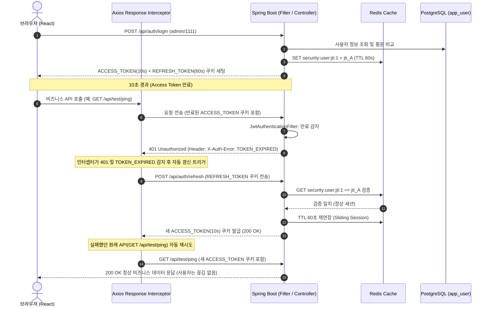

# AssetERP 차세대 보안(Security) 아키텍처 및 상세 설계서

> **프로젝트**: AssetERP 차세대 전환 보안 프로토타입 (`security-test`)  
> **기준 일자**: 2026-09-29  
> **대상 환경**: Java 21 (LTS) / Spring Boot 3.4.3 / Spring Security 6.x / React 19 / Ant Design 5.x / PostgreSQL 15 / Redis 7.x / Tomcat 10.1 (WAR)

---

## 1. 개요 및 목적

본 문서는 레거시 자산운용사 ERP(GWT/GXT, Java 8 기반)를 **Spring Boot + React** 스택으로 전환함에 있어, 시스템의 핵심 보안 요구사항을 충족하기 위한 **JWT 기반 인증·인가, Redis 연동 동시(멀티) 로그인 차단, 이중 토큰 자동 갱신(Silent Refresh), 파일 업로드 바이너리 위변조 검증(Apache Tika)**의 아키텍처와 상세 구현 내용을 정리한 문서이다.

### 1.1 핵심 요구사항
1. **JWT & HttpOnly 쿠키 인증**: XSS 방지를 위해 토큰을 자바스크립트 접근이 불가한 `HttpOnly` 쿠키에 저장하여 전송.
2. **이중 토큰(Access / Refresh) 구조**: 
   - `Access Token`: 10초 (탈취 피해 최소화)
   - `Refresh Token`: 60초 (무중단 작업 보장)
3. **무중단 자동 갱신 (Silent Refresh & Sliding Session)**:
   - 10초가 지나 Access Token이 만료되어도, 프론트엔드 Axios 인터셉터가 백그라운드에서 Refresh Token으로 자동 갱신하여 사용자는 끊김 없이 작업 유지.
   - 통신이 지속되는 한 세션은 1분씩 자동 연장(Sliding Session).
4. **동시(멀티) 로그인 즉시 차단 (JTI 기반)**:
   - 다른 기기/브라우저에서 동일 계정으로 로그인 시 Redis의 활성 `JTI`를 갱신하여, **이전 브라우저의 접속을 즉시 차단 (`MULTI_LOGIN_DETECTED`)**.
5. **예외 시 자동 리다이렉트 및 사유 안내**:
   - Refresh Token 완전 만료(1분 방치) 또는 동시 접속 차단 발생 시, 즉시 로그인 페이지로 자동 이동하고 해당 사유를 안내 배너(`Alert`)로 표시.
6. **Apache Tika 기반 Magic Number MIME 검증**:
   - 파일 업로드 시 확장자 위변조(예: `.exe`를 `.jpg`로 변경)를 방지하기 위해 파일의 바이너리 매직 넘버를 검사.
7. **WAR 배포 및 퍼블릭 리소스 허용**:
   - SpringBootServletInitializer 상속, Tomcat 10.1 배포 및 SPA 정적 리소스 / 퍼블릭 API 허용.

---

## 2. 시스템 아키텍처 및 기술 스택

### 2.1 기술 스택 명세

| 구분 | 기술 / 라이브러리 | 버전 | 라이선스 | 역할 |
|:---|:---|:---|:---|:---|
| **Language** | Java | `21 (LTS)` | Eclipse Temurin | 가상 스레드, Records, 패턴 매칭 등 최신 기능 활용 |
| **Framework** | Spring Boot | `3.4.3` | Apache-2.0 | 최신 백엔드 애플리케이션 프레임워크 (jakarta.*) |
| **Security** | Spring Security | `6.4.x` | Apache-2.0 | `SecurityFilterChain` Bean, Lambda DSL 기반 보안 설정 |
| **Token** | JJWT | `0.12.6` | Apache-2.0 | HMAC-SHA256 기반 JWT 생성, 파싱, 서명 검증 |
| **Database** | PostgreSQL | `15.x / 16.x` | PostgreSQL License | 사용자 정보(`app_user`) 및 영속성 데이터 저장 |
| **Cache/Session**| Redis | `7.x` | BSD-3-Clause | 사용자별 활성 `JTI` 관리, 세션 TTL 및 동시 로그인 제어 |
| **ORM/SQL** | MyBatis | `3.0.4` | Apache-2.0 | XML 기반 SQL 매핑 및 카멜케이스 자동 변환 |
| **MIME 검증** | Apache Tika | `2.9.2` | Apache-2.0 | 파일 바이너리 Magic Number 기반 실제 MIME 타입 판별 |
| **Packaging** | WAR (bootWar) | - | - | 외장 WAS (Apache Tomcat 10.1) 배포 지원 |
| **Frontend** | React / TypeScript | `19.x / 5.7` | MIT / Apache-2.0 | UI 컴포넌트 아키텍처 및 엄격한 타입 안정성 |
| **Build Tool** | Vite | `6.x` | MIT | 초고속 HMR 및 프로덕션 번들러 |
| **UI Library** | Ant Design | `5.24.x` | MIT | ERP 환경에 최적화된 Form, Table, Progress, Alert 컴포넌트 |
| **HTTP Client** | Axios | `1.7.x` | MIT | `withCredentials` 쿠키 송수신 및 자동 재발급 인터셉터 |

---

## 3. 세부 설계 및 동작 원리

### 3.1 JWT Payload 규격
JWT의 `sub` 클레임은 `user_id`를 의미하며, RBAC 권한 제어와 세션 고유 식별을 위해 아래와 같은 클레임을 포함한다:

```json
{
  "sub": "1",
  "iss": "asset-erp",
  "iat": 1790654992,
  "exp": 1790655002,
  "jti": "18bb2206-01c8-4630-bc18-86fea8f82daf",

  "username": "admin",
  "name": "시스템 관리자",
  "company_id": 100,
  "dept_id": "D101",
  "roles": [
    "ROLE_ADMIN"
  ]
}
```

### 3.2 이중 쿠키 정책

| 쿠키 이름 | 유효 시간 | 보안 속성 | 용도 |
|:---|:---|:---|:---|
| `ACCESS_TOKEN` | **10초** (`jwt.access-token-expiration`) | `HttpOnly`, `SameSite=Lax`, `Path=/` | 모든 보호된 API 인가에 사용 |
| `REFRESH_TOKEN` | **60초** (`jwt.refresh-token-expiration`) | `HttpOnly`, `SameSite=Lax`, `Path=/` | Access Token 만료 시 재발급에 사용 |

> **보안 이점**: 토큰이 자바스크립트 `document.cookie`나 `localStorage`에 노출되지 않으므로 XSS(Cross-Site Scripting) 공격으로 인한 토큰 탈취가 불가능하다.

---

### 3.3 동시(멀티) 로그인 차단 메커니즘 (JTI 기반)

동시 로그인을 차단하고 이전 세션을 즉시 무효화하기 위해 **Redis에 사용자별 활성 `JTI(JWT ID)`를 매핑**하여 관리한다.

1. **Redis Key**: `security:user:jti:{userId}`  
   - Value: 현재 유효한 세션의 `jti` (UUID)  
   - TTL: Refresh Token 유효시간 (기본 60초)
2. **새 로그인 발생 시**:
   - 신규 `jti`를 생성하여 Redis의 해당 키에 덮어쓴다 (`SET security:user:jti:1 <new-jti> EX 60`).
3. **요청 검증 시 (`JwtAuthenticationFilter`)**:
   - 요청 쿠키의 JWT에서 `userId`와 `jti`를 추출.
   - Redis에 보관된 활성 `jti`와 비교:
     - **일치**: 정상 처리 (`SecurityContextHolder`에 인증 객체 등록).
     - **불일치**: 다른 기기에서 로그인되었음을 의미하므로 즉시 **401 Unauthorized (`X-Auth-Error: MULTI_LOGIN_DETECTED`)** 로 차단.
4. **리프레시 요청 시 (`POST /api/auth/refresh`)**:
   - `REFRESH_TOKEN`의 `jti` 역시 Redis의 활성 `jti`와 일치해야만 재발급을 허용. 다른 브라우저에서 로그인된 경우 갱신도 거부됨.

---

### 3.4 무중단 자동 토큰 갱신 (Silent Refresh) 시퀀스



---

### 3.5 세션 종료 및 로그인 화면 리다이렉트 흐름

사용자가 세션을 상실하는 2가지 경우, 프론트엔드가 즉시 로그인 화면으로 전환하고 직관적인 메시지를 표시한다:

```mermaid
flowchart TD
    A[API 요청 또는 타이머 확인] --> B{요청 결과 판별}
    
    B -->|401 & MULTI_LOGIN_DETECTED| C[동시 접속 차단 이벤트 발생]
    B -->|401 & Refresh Token 완전 만료| D[세션 만료 이벤트 발생]
    B -->|타이머 60초 모두 경과| D
    
    C --> E[setUser = null 즉시 상태 초기화]
    D --> E
    
    E --> F[로그인 페이지(LoginPage) 렌더링]
    
    F -->|동시 접속 차단 사유| G["⛔ Alert: 다른 기기 또는 브라우저에서 로그인되어 현재 세션이 종료되었습니다."]
    F -->|세션 만료 사유| H["⚠️ Alert: 세션 유효시간(리프레시 토큰 1분)이 모두 만료되었습니다. 다시 로그인해주세요."]
```

---

## 4. 데이터베이스 및 스키마 설계

### 4.1 `app_user` 테이블 구조

```sql
DROP TABLE IF EXISTS app_user;

CREATE TABLE app_user (
    user_id     BIGSERIAL PRIMARY KEY,
    company_id  INTEGER,
    username    VARCHAR(50)  NOT NULL UNIQUE,
    password    VARCHAR(100) NOT NULL, -- 테스트 환경 특성: 평문 저장 및 비교
    full_name   VARCHAR(100) NOT NULL,
    role        VARCHAR(20)  NOT NULL DEFAULT 'ROLE_USER',
    created_at  TIMESTAMP WITH TIME ZONE DEFAULT CURRENT_TIMESTAMP
);

-- 테스트용 기초 계정
INSERT INTO app_user (company_id, username, password, full_name, role)
VALUES
    (100, 'admin', '1111', '시스템 관리자', 'ROLE_ADMIN'),
    (100, 'user1', '1111', '일반 사용자', 'ROLE_USER');
```

---

## 5. Apache Tika 기반 파일 업로드 보안

### 5.1 검증 원리
클라이언트가 전송하는 `Content-Type` 헤더나 확장자는 손쉽게 조작될 수 있다(예: `malware.exe` 파일의 확장자를 `sample.png`로 위장).  
이를 차단하기 위해 **Apache Tika (`org.apache.tika:tika-core`)** 를 적용하여 파일의 첫 몇 바이트인 **매직 넘버(Magic Number)** 를 분석, 실제 MIME 타입을 서버에서 강제 판별한다:

```java
try (InputStream is = file.getInputStream()) {
    String detectedMimeType = tika.detect(is, originalFilename);
    // 선언된 Content-Type과 실제 감지된 MIME Type을 비교 및 검증 기록
}
```

- 저장소: `${asseterp.base.dir}/uploads`
- 최대 업로드 크기: 단일 500MB, 전체 500MB (`spring.servlet.multipart.max-file-size=500MB`)
- 한글 파일명 다운로드 처리: RFC 5987 표준 `Content-Disposition: attachment; filename="..."; filename*=UTF-8''...` 인코딩 지원.

---

## 6. 프로젝트 파일 구조 및 핵심 컴포넌트

```
security-test/
├── backend/                                   # Spring Boot 3.4.3 (Java 21, WAR)
│   ├── build.gradle                           # 의존성 정의 (Security, JJWT, Redis, MyBatis, Tika)
│   └── src/main/
│       ├── java/com/asseterp/security/
│       │   ├── SecurityTestApplication.java   # SpringBootServletInitializer 구현
│       │   ├── common/
│       │   │   ├── config/
│       │   │   │   ├── SecurityConfig.java    # SecurityFilterChain, Public 엔드포인트 허용
│       │   │   │   └── RedisConfig.java       # RedisConnectionFactory (호스트 자동 Fallback)
│       │   │   ├── jwt/
│       │   │   │   ├── JwtTokenProvider.java       # 토큰 생성/검증, Claims/JTI 추출
│       │   │   │   ├── JwtAuthenticationFilter.java# 쿠키 토큰 추출 및 Redis JTI 대조
│       │   │   │   ├── RedisTokenService.java      # Redis 활성 JTI 등록/조회/삭제
│       │   │   │   └── JwtAuthenticationEntryPoint.java # 401 응답 및 X-Auth-Error 헤더 출력
│       │   │   └── dto/ApiResponse.java       # 공통 응답 레코드
│       │   └── biz/
│       │       ├── auth/
│       │       │   ├── controller/AuthController.java # 로그인, 리프레시, 로그아웃, 내 정보
│       │       │   ├── service/AuthService.java       # 인증 비즈니스 로직
│       │       │   └── dto/UserPrincipal.java         # UserDetails 구현체
│       │       ├── test/
│       │       │   └── controller/TestController.java # 자유 서버 통신 테스트 (Ping)
│       │       ├── file/
│       │       │   ├── controller/FileController.java # 파일 업/다운로드 엔드포인트
│       │       │   └── service/FileStorageService.java# Apache Tika Magic Number 검사 및 저장
│       │       └── user/
│       │           ├── entity/AppUser.java            # app_user 매핑 엔티티
│       │           └── mapper/AppUserMapper.java      # MyBatis 매퍼 인터페이스
│       └── resources/
│           ├── application.properties         # DB, Redis, JWT 수명, 업로드 디렉토리 설정
│           └── mapper/AppUserMapper.xml       # PostgreSQL 쿼리 매퍼
├── frontend/                                  # React 19 + TypeScript + Ant Design 5
│   ├── src/
│   │   ├── api/
│   │   │   ├── client.ts                      # Axios 인스턴스 (인터셉터, Silent Refresh, 세션종료 이벤트)
│   │   │   ├── auth.ts                        # 로그인, 로그아웃, 리프레시 API
│   │   │   ├── file.ts                        # 파일 업로드/목록/다운로드 API
│   │   │   └── test.ts                        # 서버 통신 Ping API
│   │   ├── pages/
│   │   │   ├── LoginPage.tsx                  # 로그인 UI (빠른 계정 버튼, 세션종료 사유 안내 Alert)
│   │   │   └── MainPage.tsx                   # 대시보드 (실시간 게이지, Ping 버튼, 파일 업로드 테이블)
│   │   └── App.tsx                            # 전역 테마 및 세션 종료 시 로그인 화면 자동 전환
│   ├── package.json
│   └── vite.config.ts                         # 상대 경로 베이스(./) 및 프록시 설정
├── bm.sh                                      # 백엔드 관리 스크립트 (run / compile)
├── fm.sh                                      # 프론트엔드 관리 스크립트 (run / compile)
├── deploy.sh                                  # 프론트 빌드 -> 정적 리소스 복사 -> WAR 패키징 -> 톰캣 자동 배포
└── make.sh                                    # 종합 환경 점검, 빌드, DB 확인 마스터 스크립트
```

---

## 7. 운영 및 테스트 가이드

### 7.1 실행 및 배포 스크립트

```bash
cd security-test

# 1. 종합 관리 마스터 스크립트 (대화형 메뉴)
./make.sh

# 2. 로컬 개발 서버 실행
./bm.sh run     # Spring Boot 백엔드 실행 (포트 8080)
./fm.sh run     # Vite 프론트엔드 개발 서버 실행 (포트 5173)

# 3. WAR 패키징 및 Docker Tomcat(8082) 자동 배포
./deploy.sh
```

- **배포 접속 URL**: [http://localhost:8082/security-test/](http://localhost:8082/security-test/)

### 7.2 시나리오별 검증 절차

1. **무중단 통신 (Silent Refresh)**:
   - 로그인 후 10초 타이머가 만료되어 `Access Token`이 `0초`가 된 상태를 확인.
   - **[서버 통신 테스트 (Ping)]** 버튼을 클릭.
   - Axios 인터셉터가 백그라운드에서 `/api/auth/refresh`를 호출하고, 곧바로 Ping 요청을 완수하여 **초록색 배너 `[토큰 자동 갱신 후 성공]`** 과 함께 200 OK가 수신됨을 확인.
2. **동시 접속 차단**:
   - 일반 창에 로그인된 상태에서 **시크릿 창**을 열어 동일한 `admin / 1111`로 로그인.
   - 원래 일반 창으로 돌아와 **[서버 통신 테스트]** 버튼을 클릭.
   - 이전 창의 세션이 즉시 무효화되어 로그인 화면으로 튕기며 **`⛔ 동시 접속 차단 안내`** 빨간색 경고가 나타남을 확인.
3. **1분 세션 완전 만료**:
   - 로그인 후 아무런 버튼도 누르지 않고 60초 동안 대기.
   - Refresh Token 타이머가 0이 되는 순간 자동으로 로그인 화면으로 이동하며 **`⚠️ 세션 만료 안내`** 노란색 경고가 나타남을 확인.
